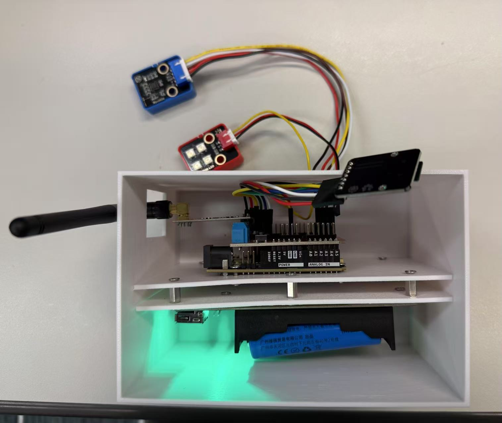
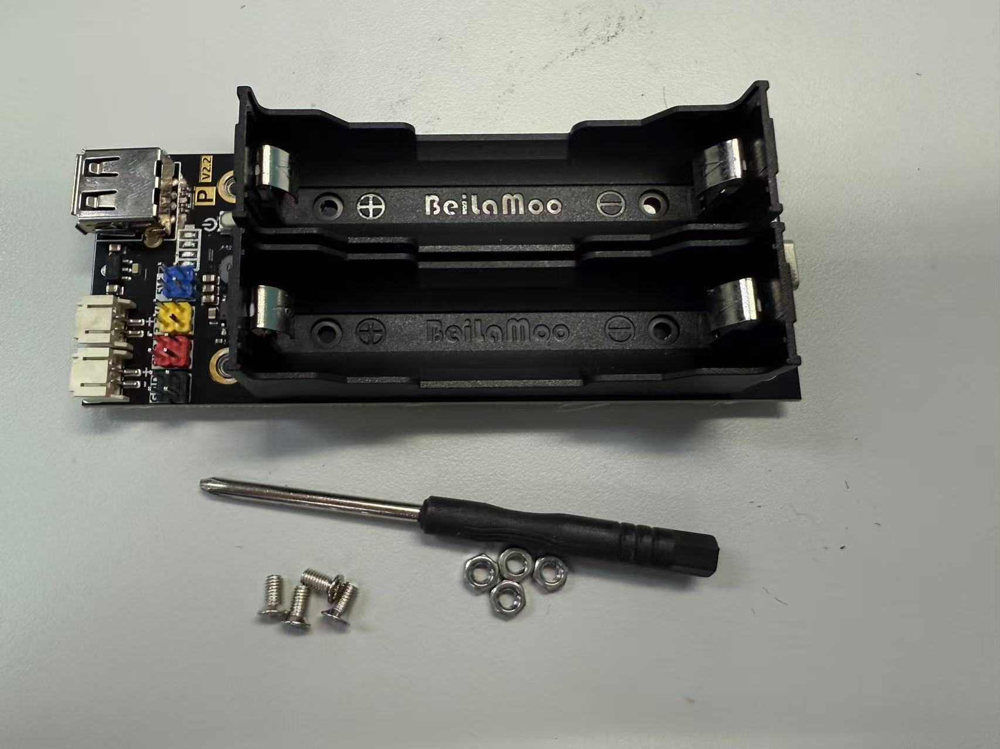
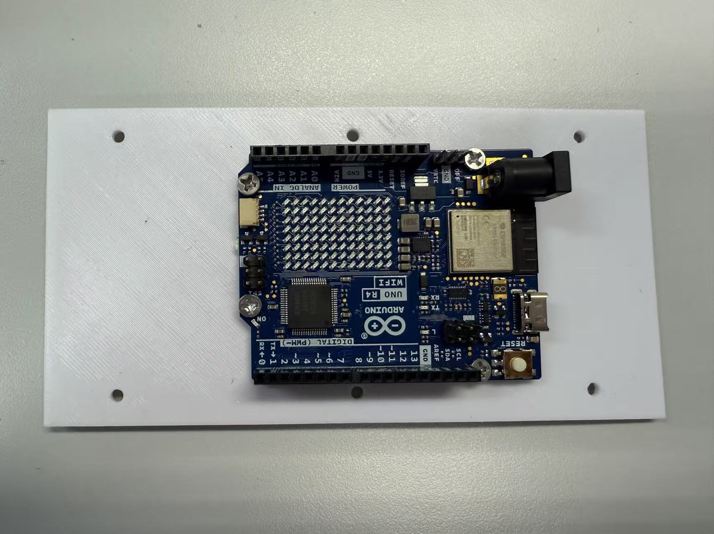
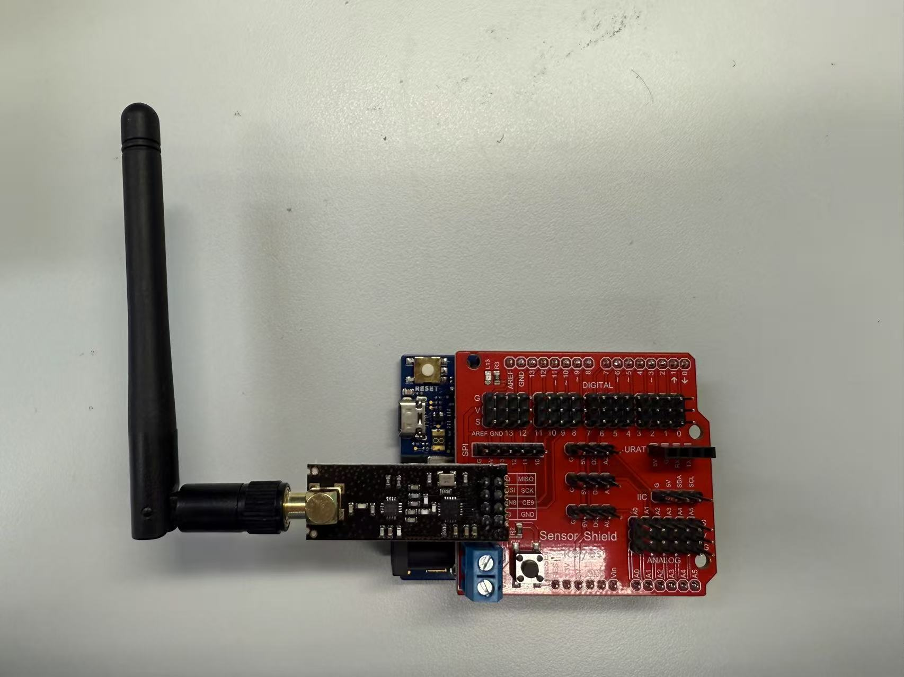
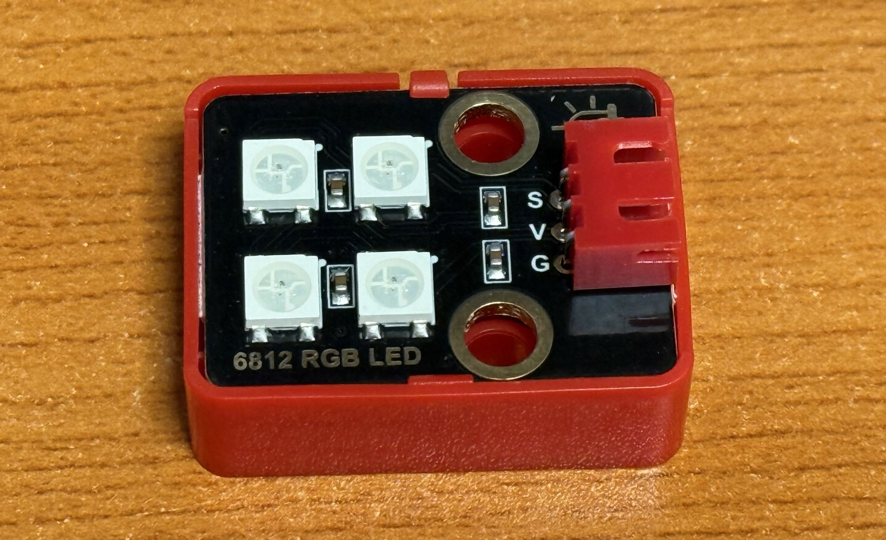

# HARDWARE ASSEMBLY

## Item List

| Component | Description |
| --------- | ----------- |
| Arduino UNO R4 WiFi | Main controller for the node, providing processing power and connectivity. |
| Sensor Shield | A shield that connects to the Arduino for easy sensor integration. |
| MPU6050 | An acceleration sensor that measures motion and orientation. |
| SD Module & Card | Used for data storage, allowing the node to log sensor data. |
| RGB LED | Provides visual feedback, indicating the status of the node. |
| NRF24L01 Module & Antenna | Enables local wireless communication between nodes. |
| BMS & Battery | Provides power to the entire node, making it portable. |
| Enclosure | Protects internal electronic components and provides a pretty appearance. |

## 1 Battery Box Installation

As shown in the pictures, take the battery box out of the packaging bag and use a screwdriver, screws, and bolts to secure it to the mounting board.

!!! warning "Caution"
    Ensure the installation position and orientation of the battery box are correct, referring to the examples in the images to ensure the smooth installation of subsequent components.

## 2 Main Control Board Installation

Install the main control board (Arduino UNO R4 WiFi) onto the corresponding mounting board using screws and bolts. Ensure the board is securely fastened.

!!! warning "Caution"
    Ensure the installation position of the main control board is correct, and that all connectors and interfaces are facing an accessible direction for subsequent connections to other components. You can refer to the examples in the images for installation.

## 3 Sensor Shield Assembly

Install the sensor shield (Sensor Shield) onto the main control board. Ensure all pins are correctly aligned and securely connected.

!!! warning "Caution"
    Make sure the sensor shield is firmly attached to the main control board and that the pins are aligned, referring to the markings near the pins. All connections should be secure to prevent disconnection during operation.

## 4 MPU6050 Installation

| MCU Pin | MPU6050 Pin |
|----------|-------------|
| VCC      | VCC         |
| GND      | GND         |
| SDA      | SDA         |
| SCL      | SCL         |
| --       | INT         |

As shown in the figure, the MPU6050 sensor needs to be connected to the main control board via the I2C interface. Using the 4-pin cable provided with the MPU6050, connect the VCC pin of the MPU6050 to the VCC pin of the Arduino, the GND pin to GND, the SDA pin to SDA, and the SCL pin to SCL. The INT pin can be left unconnected.

## 5 RF24L01 Module Installation

As shown in the figure, after assembling the RF module, simply plug it into the sensor shield. Ensure that the pins of the RF module are correctly aligned and securely connected.

## 6 RGB LED Installation

| Arduino Pin | 6812 RGB LED Pin |
|-------------|------------------|
| V           | V                |
| G           | G                |
| S （D7）    | S                |

Connect the RGB LED to the sensor shield using the associated Dupont wires. Connect the RGB LED's pins to the corresponding pins on the sensor shield.

!!! warning "Caution"
    Ensure the RGB LED is connected correctly, with the V pin to V, G pin to G, and S pin to D7. This will ensure proper operation of the LED for visual feedback.

## 7 SD Module Installation

| Arduino Pin | SD Card Module Pin |
|-------------|--------------------|
| 5V          | VCC                |
| GND         | GND                |
| D10         | CS                 |
| D11         | MOSI               |
| D12         | MISO               |
| D13         | SCK                |

As shown in the figure, the SD card module needs to be connected to the main control board via the SPI interface.

!!! warning "Caution"
    Ensure the connections of the SD card module are correct and secure. If the dupont wires are loose, please replace them or contact technical support.

## 8 Enclosure Assembly

!!! warning "Caution"
    This step should be performed after programming is complete to ensure all components can be correctly placed.

- Use the standoffs and bolts to secure the battery box and the mounting board where the main control board is located.

- Put the batteries into the battery box, ensuring they are correctly oriented. Don't press to hard, as it cannot be fully pressed down due to the mismatch of the size of the battery box and the battery.

- Put the whole node into the enclosure, ensuring all components are securely placed and that the enclosure is closed properly.

!!! warning "Caution"
    How the node should be placed inside the enclosure is up to the specific requirements of the experiment being conducted.

