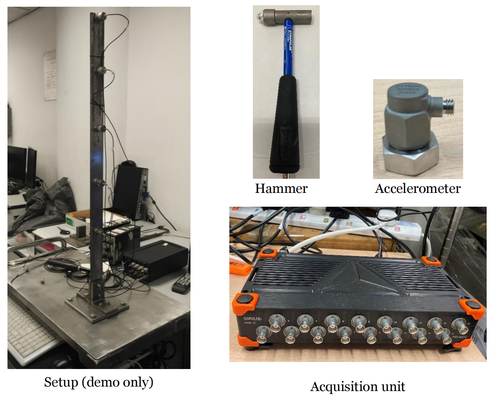

# Sensor Deployment

## Laboratory Test - Cantilever Beam Experiment

### Test Time and Location

Date: July 29, 2025 4:00 PM - 5:00 PM
Location: ZS1107

### Objectives

- Learn to use a wireless sensor network for data acquisition and transmission  
- Calibrate the sensors

### Equipment

- ArduinoNode  
- Wired sensors  
- Cantilever beam structure

### Test Procedure

- After placing the sensors into their enclosures, fix and attach them securely to the cantilever beam. Ensure the wired sensor and the ArduinoNode sensor are placed closely and firmly together.
- Simultaneously collect data from both the wired sensor and the ArduinoNode sensor.
- Retrieve sensor data from the SD card module.
- Plot the time-history curves and frequency spectra of the sensor data.
- Calibrate the scaling factors of the three axes of the sensor.
