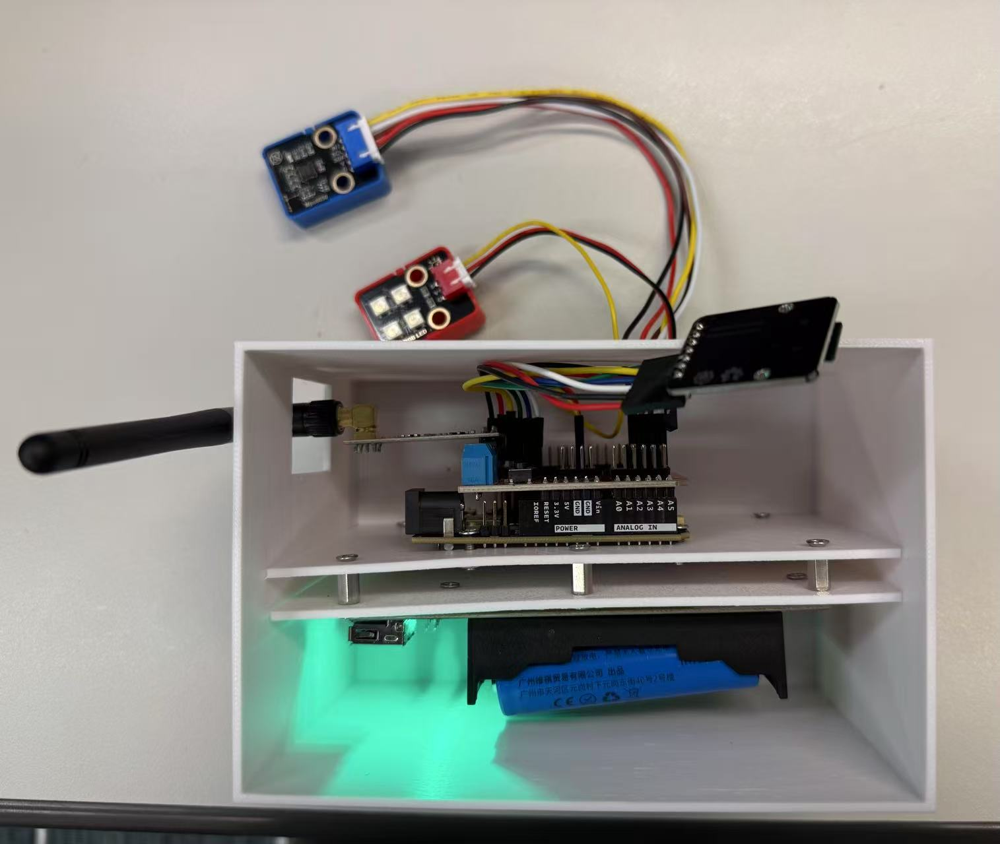

# 传感器部署

## 实验室测试 - 悬臂梁试验

### 试验时间地点

时间：2025年7月29日 下午 4:00 - 5:00

地点：ZS1107

### 试验目的

- 学习使用无线传感器网络进行数据采集和传输

- 校准传感器

### 试验设备

- ArduinoNode

- 有线传感器

- 悬臂梁结构
  

### 试验步骤

- 将传感器装入外壳后，固定好，粘贴到悬臂梁上，将有线传感器和ArduinoNode的传感器紧贴固定。

- 同时采集有线传感器和ArduinoNode的传感器数据。

- 读取sd卡模块中的传感器数据。

- 绘制传感器时程曲线和频谱图。

- 校准传感器三个轴方向的系数。