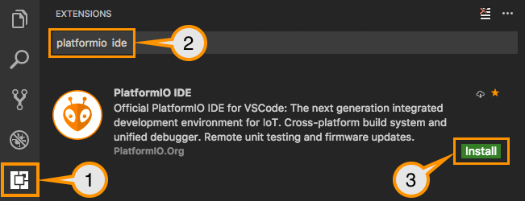
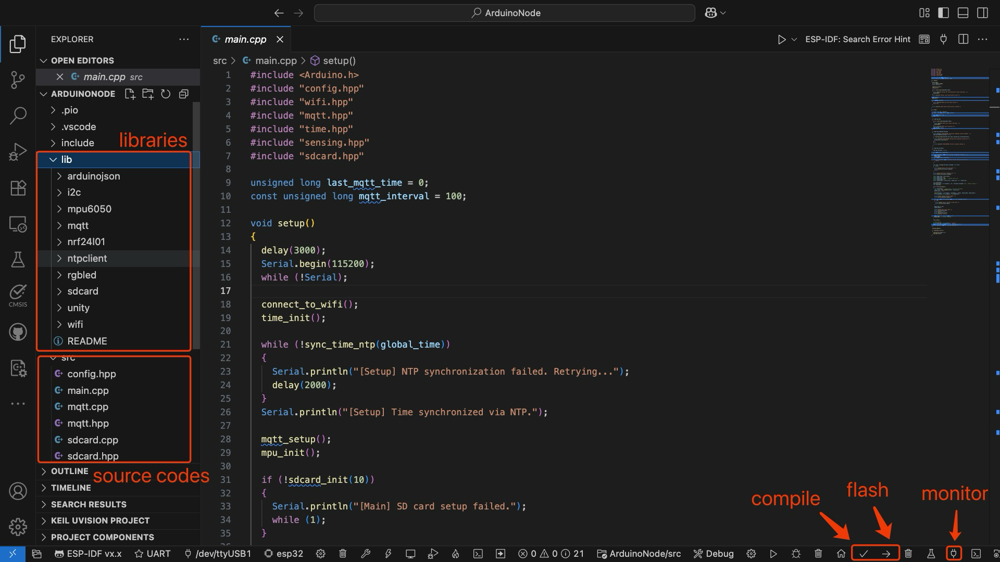

# PROGRAMMING

## 1 PREPARATION

### 1.1 Install VSCode

<div class="grid cards" markdown>

-   :material-microsoft-visual-studio-code:{ .lg .middle } __VSCode__

    ---

    [:octicons-arrow-right-24: <a href="https://code.visualstudio.com/download" target="_blank"> Download Link </a>](#)

</div>

### 1.2 Install PlatformIO



(1) Open VSCode Extension Manager

(2) Search for official PlatformIO IDE extension

(3) Install PlatformIO IDE.

### 1.3 Install Serial Monitor


(1) Open VSCode Extension Manager

(2) Search for official Serial Monitor extension

(3) Install Serial Monitor extension.

### 1.4 Download Project Code

Choose one of the following two options:

<div class="grid cards" markdown>

-   :material-file:{ .lg .middle } __Google Drive__

    ---

    [:octicons-arrow-right-24: <a href="https://drive.google.com/file/d/1GV5ttSBR1FWHn3wxK_Axs-CiQGayG9vq/view?usp=sharing" target="_blank"> Download Link </a>](#)

-   :material-file:{ .lg .middle } __GitHub__

    ---

    [:octicons-arrow-right-24: <a href="https://github.com/Shuaiwen-Cui/APESS2025_ArduinoNode/blob/main/APESS2025-CODE.zip" target="_blank"> Download Link </a>](#)

</div>

After downloading, extract the files to your chosen directory.

## 2 PROGRAMMING

### 2.1 Open Project in VSCode

(1) Launch VSCode.

(2) Open the folder where you extracted the project code.

(3) You should see the project structure in the Explorer panel.

### 2.2 TASK 1 - Modify Configuration File

Open the `src/config.h` file in the project directory. You will see a section like this:


```cpp
#pragma once
#include <Arduino.h>

/* Node Information */
// #define GATEWAY          // for main node
#define LEAFNODE        // for sensor node

// #define NODE_ID 100      // GATEWAY should be 100
#define NODE_ID 1 // for LEAFNODE: 1, 2, 3, 4, 5, 6, 7, 8
// #define NODE_ID 2
// #define NODE_ID 3
// #define NODE_ID 4
// #define NODE_ID 5
// #define NODE_ID 6
// #define NODE_ID 7
// #define NODE_ID 8

#define NUM_NODES 8 // Total number of nodes in the network

/* WiFi Credentials */
#define WIFI_SSID "Shaun's Iphone"
#define WIFI_PASSWORD "cshw0918"

/* MQTT Configurations */
// #define MQTT_CLIENT_ID      "GATEWAY"
#define MQTT_CLIENT_ID      "LEAFNODE1"
// #define MQTT_CLIENT_ID      "LEAFNODE2"
// #define MQTT_CLIENT_ID      "LEAFNODE3"
// #define MQTT_CLIENT_ID      "LEAFNODE4"
// #define MQTT_CLIENT_ID      "LEAFNODE5"
// #define MQTT_CLIENT_ID      "LEAFNODE6"
// #define MQTT_CLIENT_ID      "LEAFNODE7"
// #define MQTT_CLIENT_ID      "LEAFNODE8"

#define MQTT_BROKER_ADDRESS "8.222.194.160"
#define MQTT_BROKER_PORT    1883
#define MQTT_USERNAME       "ArduinoNode"
#define MQTT_PASSWORD       "Arduino123"
#define MQTT_TOPIC_PUB      "ArduinoNode/node"
#define MQTT_TOPIC_SUB      "ArduinoNode/server"

// Sensing Variables 
extern uint64_t sensing_scheduled_start_ms; // Scheduled sensing start time (Unix ms)
extern uint64_t sensing_scheduled_end_ms;   // Scheduled sensing end time (Unix ms)
extern uint32_t sensing_rate_hz;            // Sensing rate in Hz
extern uint32_t sensing_duration_s;         // Sensing duration in seconds
extern uint32_t default_sensing_rate_hz;   // Default sensing rate in Hz
extern uint32_t default_sensing_duration_s; // Default sensing duration in seconds
extern uint16_t parsed_freq;                // Parsed frequency from command
extern uint16_t parsed_duration;            // Parsed duration from command
extern float cali_scale_x; // Calibration scale for X-axis
extern float cali_scale_y; // Calibration scale for Y-axis
extern float cali_scale_z; // Calibration scale for Z-axis

/* Serial Configurations */
// #define DATA_PRINTOUT // Enable data printout to Serial

// === Function Declaration ===
void print_node_config();
```
You need to modify two parts:

1. `NODE_ID`: Set it to your group number (1-8). For example, if you are in group 5, uncomment the corresponding `NODE_ID` line and comment out the others.

2. `MQTT_CLIENT_ID`: Set it to your group number (1-8). For example, if you are in group 5, uncomment the corresponding `MQTT_CLIENT_ID` line and comment out the others.

### 2.3 TASK 2 - Complete the Sensing Code
In the `src/sensing.cpp` file, you need to complete the code for sensor data acquisition. Open the file and find the following commented section:

```cpp

void sensing_sample_once()
{
    // Check current time
    uint32_t now_ms = Time.get_time();

    // Check if we should sample
    if (now_ms - last_sample_time >= (1000 / sensing_rate_hz))
    {
        // if yes, update the last sample time
        last_sample_time += (1000 / sensing_rate_hz);

        // Prepare the variables for reading IMU data
        int16_t ax, ay, az;

        // <Read acceleration data from the IMU, to be completed by students, refering to mpu6050.hpp and mpu6050.cpp>

        // Calculate the elapsed time since the start of sensing
        uint32_t elapsed = now_ms - t_start_ms;

        // Converting raw acceleration data to g's using the scaling factor and calibration factors
        float ax_g = ax * cali_scale_x / 16384.0f;
        float ay_g = ay * cali_scale_y / 16384.0f;
        float az_g = az * cali_scale_z / 16384.0f;

        // print the data to the SD card file
        char line[64];
        snprintf(line, sizeof(line), "%8lu,%8.6f,%8.6f,%8.6f", elapsed, ax_g, ay_g, az_g);
        data_file.println(line);

        // Update the number of samples taken
        sample_count++;
    }
}
```

In the section marked `<Read acceleration data from the IMU, to be completed by students, refering to mpu6050.hpp and mpu6050.cpp>`, you need to call the functions in the IMU library to read the acceleration data. The specific functions can be found in the `mpu6050.hpp` and `mpu6050.cpp` files. This function is key to sensing and can help you better understand the process of acquiring sensor data.

### 2.4 Compile and Upload Code

Make sure that the code is complete and verified, and consult your instructor or technical support if needed. Then follow the steps below to compile and upload the code:



1. Ensure that the development board is connected to the computer via a Type-C cable.
2. In the PlatformIO toolbar at the bottom of VSCode, click the "Build" button to compile the code.
3. Once the compilation is complete, click the "Upload" button to upload the code to the development board.

### 2.5 View Serial Output

You can use PlatformIO’s built-in serial monitor to view the output from the development board. Click the "Serial Monitor" button at the bottom, select the correct COM port (usually COM3 or a similar name), set the baud rate to 115200, and then click "Connect" to view the output.

!!! warning
    Only one program can access the serial port at a time. Make sure no other programs are occupying the port. Note that when flashing the firmware, you should close any serial communication first, otherwise the upload might fail.

## 3 TESTING

After uploading the code, you can check if the system is functioning correctly by observing the RGB LED colors and the serial output.

!!! tip
    If the RGB LED color is always white, it indicates that there is a problem during the initialization process. Please check the hardware connections. A sky blue state indicates RF communication, meaning it is waiting to communicate with the main node and needs to be tested in conjunction with the main node's signal. Green indicates that initialization is complete and it has entered the IDLE state, waiting for commands from the main node. Yellow is the preparation state before data collection, purple is the state of data collection, and red is the error state, which may be caused by sensor initialization failure or other issues.