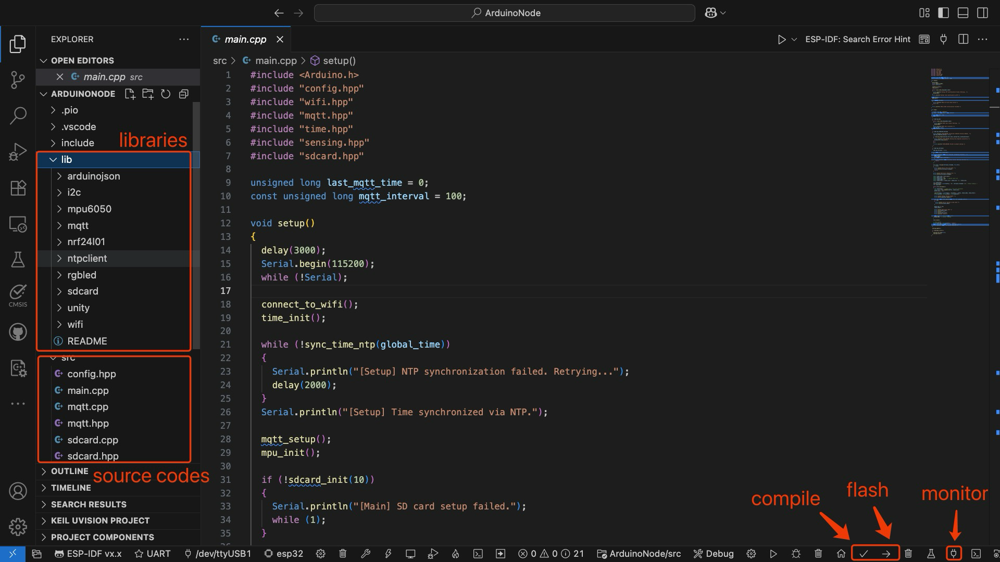

# 编程

## 1 准备工作

### 1.1 安装 VSCode

<div class="grid cards" markdown>

-   :material-microsoft-visual-studio-code:{ .lg .middle } __VSCode__

    ---

    [:octicons-arrow-right-24: <a href="https://code.visualstudio.com/download" target="_blank"> 下载链接 </a>](#)

</div>

### 1.2 PlatformIO安装


(1) 打开 VSCode 扩展管理器

(2) 搜索官方 PlatformIO IDE 扩展

(3) 安装 PlatformIO IDE。


### 1.3 Serial Monitor 安装


(1) 打开 VSCode 扩展管理器

(2) 搜索官方 Serial Monitor 扩展

(3) 安装 Serial Monitor 扩展。

### 1.4 下载项目代码

以下两种方式二选一即可：

<div class="grid cards" markdown>

-   :material-file:{ .lg .middle } __Google Drive__

    ---

    [:octicons-arrow-right-24: <a href="https://drive.google.com/file/d/1GV5ttSBR1FWHn3wxK_Axs-CiQGayG9vq/view?usp=sharing" target="_blank"> 下载链接 </a>](#)

-   :material-file:{ .lg .middle } __GitHub__

    ---

    [:octicons-arrow-right-24: <a href="https://github.com/Shuaiwen-Cui/APESS2025_ArduinoNode/blob/main/APESS2025-CODE.zip" target="_blank"> 下载链接 </a>](#)

</div>

下载后，将文件解压到您选择的目录中。


## 2 编程

### 2.1 打开项目

(1) 打开 VSCode

(2) 点击左侧的文件图标，选择“打开文件夹”

(3) 选择解压后的项目文件夹打开

### 2.2 TASK 1 - 修改配置文件

这里需要将`src/config.hpp`文件中的以下内容修改为你对应小组的信息。打开`src/config.hpp`文件，找到以下代码段：

```cpp
#pragma once
#include <Arduino.h>

/* Node Information */
// #define GATEWAY          // for main node
#define LEAFNODE        // for sensor node

// #define NODE_ID 100      // GATEWAY should be 100
#define NODE_ID 1 // for LEAFNODE: 1, 2, 3, 4, 5, 6, 7, 8
// #define NODE_ID 2
// #define NODE_ID 3
// #define NODE_ID 4
// #define NODE_ID 5
// #define NODE_ID 6
// #define NODE_ID 7
// #define NODE_ID 8

#define NUM_NODES 8 // Total number of nodes in the network

/* WiFi Credentials */
#define WIFI_SSID "Shaun's Iphone"
#define WIFI_PASSWORD "cshw0918"

/* MQTT Configurations */
// #define MQTT_CLIENT_ID      "GATEWAY"
#define MQTT_CLIENT_ID      "LEAFNODE1"
// #define MQTT_CLIENT_ID      "LEAFNODE2"
// #define MQTT_CLIENT_ID      "LEAFNODE3"
// #define MQTT_CLIENT_ID      "LEAFNODE4"
// #define MQTT_CLIENT_ID      "LEAFNODE5"
// #define MQTT_CLIENT_ID      "LEAFNODE6"
// #define MQTT_CLIENT_ID      "LEAFNODE7"
// #define MQTT_CLIENT_ID      "LEAFNODE8"

#define MQTT_BROKER_ADDRESS "8.222.194.160"
#define MQTT_BROKER_PORT    1883
#define MQTT_USERNAME       "ArduinoNode"
#define MQTT_PASSWORD       "Arduino123"
#define MQTT_TOPIC_PUB      "ArduinoNode/node"
#define MQTT_TOPIC_SUB      "ArduinoNode/server"

// Sensing Variables 
extern uint64_t sensing_scheduled_start_ms; // Scheduled sensing start time (Unix ms)
extern uint64_t sensing_scheduled_end_ms;   // Scheduled sensing end time (Unix ms)
extern uint32_t sensing_rate_hz;            // Sensing rate in Hz
extern uint32_t sensing_duration_s;         // Sensing duration in seconds
extern uint32_t default_sensing_rate_hz;   // Default sensing rate in Hz
extern uint32_t default_sensing_duration_s; // Default sensing duration in seconds
extern uint16_t parsed_freq;                // Parsed frequency from command
extern uint16_t parsed_duration;            // Parsed duration from command
extern float cali_scale_x; // Calibration scale for X-axis
extern float cali_scale_y; // Calibration scale for Y-axis
extern float cali_scale_z; // Calibration scale for Z-axis

/* Serial Configurations */
// #define DATA_PRINTOUT // Enable data printout to Serial

// === Function Declaration ===
void print_node_config();
```

请修改两个地方：

1. NODE_ID：将其设置为您的小组编号（1-8），比如您所在的是小组5，则将对应的NODE_ID取消注释，而其他小组的NODE_ID注释掉。

2. MQTT_CLIENT_ID：将其设置为您的小组编号（1-8），比如您所在的是小组5，则将对应的MQTT_CLIENT_ID取消注释，而其他小组的MQTT_CLIENT_ID注释掉。


### 2.3 TASK 2 - 补全传感部分代码

在`src/sensing.cpp`文件中，您需要补全传感器数据采集的代码。打开该文件，找到以下注释部分：

```cpp

void sensing_sample_once()
{
    // Check current time
    uint32_t now_ms = Time.get_time();

    // Check if we should sample
    if (now_ms - last_sample_time >= (1000 / sensing_rate_hz))
    {
        // if yes, update the last sample time
        last_sample_time += (1000 / sensing_rate_hz);

        // Prepare the variables for reading IMU data
        int16_t ax, ay, az;

        // <Read acceleration data from the IMU, to be completed by students, refering to mpu6050.hpp and mpu6050.cpp>
        

        // Calculate the elapsed time since the start of sensing
        uint32_t elapsed = now_ms - t_start_ms;

        // Converting raw acceleration data to g's using the scaling factor and calibration factors
        float ax_g = ax * cali_scale_x / 16384.0f;
        float ay_g = ay * cali_scale_y / 16384.0f;
        float az_g = az * cali_scale_z / 16384.0f;

        // print the data to the SD card file
        char line[64];
        snprintf(line, sizeof(line), "%8lu,%8.6f,%8.6f,%8.6f", elapsed, ax_g, ay_g, az_g);
        data_file.println(line);

        // Update the number of samples taken
        sample_count++;
    }
}
```

在显示注释`<Read acceleration data from the IMU, to be completed by students, refering to mpu6050.hpp and mpu6050.cpp>`的地方，您需要调用IMU库中的函数来读取加速度数据。具体的函数可以参考`mpu6050.hpp`和`mpu6050.cpp`文件。该函数是进行传感的关键函数，可以帮助你更好地理解传感器数据的获取过程。

### 2.4 编译和上传代码

请先确保代码已经完成，可以与老师或者技术支持进行确认。然后按照以下步骤编译和上传代码：



1. 确保已经通过Type-C连接将开发板连接到电脑。
2. 在VSCode底部Platformio的操作图标中，选择“编译”按钮进行代码编译。
3. 编译完成后，选择“上传”按钮将代码上传到开发板。

### 2.5 查看串口输出

您可以通过Platformio自带的串口监视器查看开发板的输出。点击底部的“串口监视器”按钮，选择正确的串口号（通常是COM3或类似名称），设定波特率为115200，然后点击“连接”按钮进行查看。

!!! warning
    串口同一时间只能被一个程序使用，请确保没有其他程序占用串口。注意烧录的时候，先把串口通讯关掉，否则烧录可能会失败。

## 3 测试

在烧录完成后，您可以通过RGBLED颜色和串口输出判断是否正常工作。

!!! tip
    如果RGBLED颜色始终为白色，说明初始化过程当中出现了问题，请检查硬件链接。天蓝色状态为RF通讯，说明在等待与主节点进行通讯，需要配合主节点的信号进行测试。绿色说明已经完成初始化，进入了IDLE状态，等待主节点的指令。黄色是采集前的准备状态，紫色是正在采集数据状态。红色是错误状态，可能是由于传感器初始化失败或者其他问题导致的。