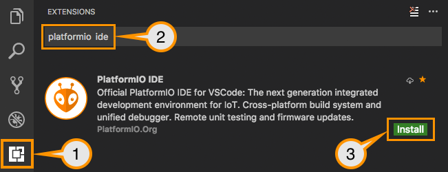
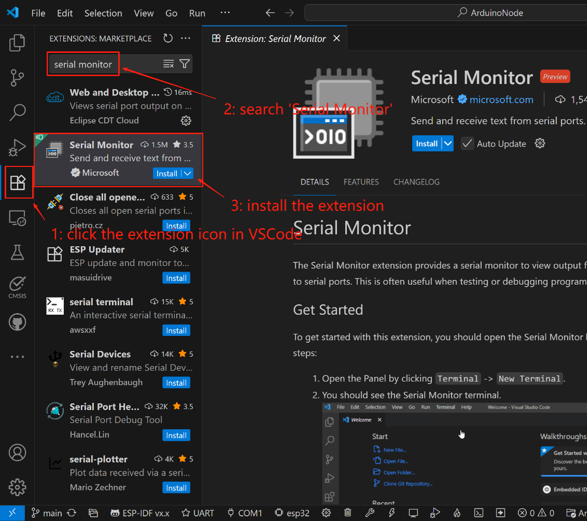

# 编程

## 1 准备工作

### 1.1 安装 VSCode

-   :material-microsoft-visual-studio-code:{ .lg .middle } __VSCode__

    ---

    [:octicons-arrow-right-24: <a href="https://code.visualstudio.com/download" target="_blank"> 下载链接 </a>](#)

### 1.2 PlatformIO安装

(1) 打开 VSCode 扩展管理器

(2) 搜索官方 PlatformIO IDE 扩展

(3) 安装 PlatformIO IDE。

### 1.3 Serial Monitor 安装

(1) 打开 VSCode 扩展管理器

(2) 搜索官方 Serial Monitor 扩展

(3) 安装 Serial Monitor 扩展。

## 1.4 下载项目代码

[下载链接](https://drive.google.com/file/d/1GV5ttSBR1FWHn3wxK_Axs-CiQGayG9vq/view?usp=sharing)