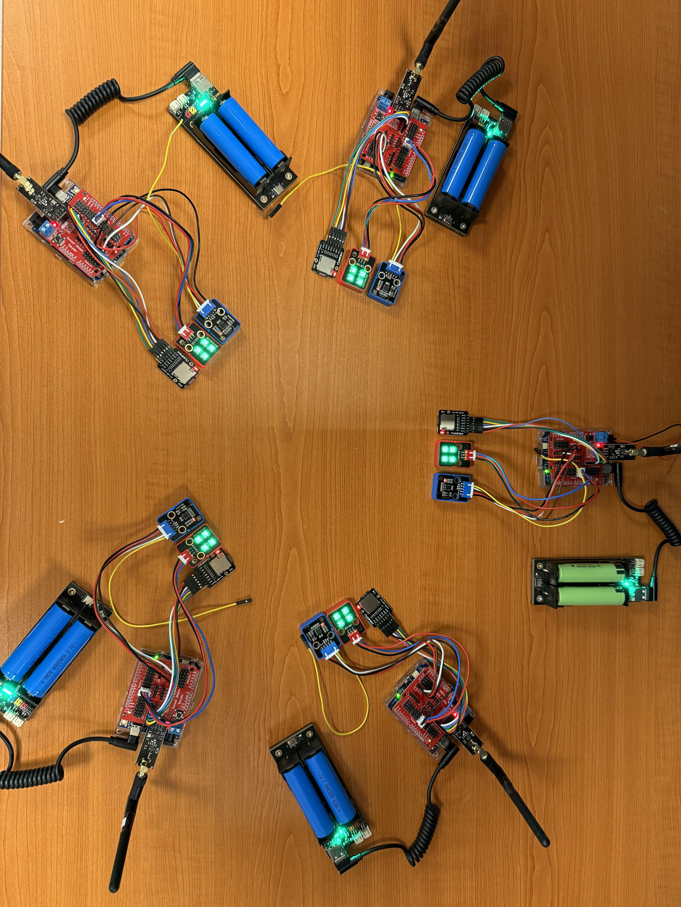

# DATASHEET

## Main Controller
| Item           | Specification            |
|----------------|--------------------------|
| MCU            | Renesas RA4M1            |
| Clock Speed    | 48 MHz                   |
| RAM            | 32 KB                    |
| Flash Storage  | 256 KB                   |

## Acceleration Measurement

| Item              | Specification              |
|-------------------|----------------------------|
| Accelerometer     | MPU6050                    |
| Measurement Range | ±2g / ±4g / ±8g / ±16g     |
| Resolution        | 16-bit                     |
| Noise Level       | 0.0004 g/√Hz               |

!!! tip
    The highest sampling rate tested during development is 250Hz, higher rates are not tested. The longest sampling duration tested is 5 minutes; longer durations are untested, with the theoretical duration being the SD card capacity divided by the sampling rate.

## Wireless Communication
- WiFi
- nRF24L01

!!! tip
    In practical tests, the WiFi module's effective range when connected to a mobile hotspot is approximately 20 meters (tested in an elevated pedestrian bridge environment over a highway).

!!! tip
    The wireless communication module has been tested at a rate of 250Kbps, with a theoretical maximum communication distance of up to 1100 meters. The longest communication distance tested during development is approximately 25m; longer distances are untested.

## Storage
- Supports up to 32 GB SD card, higher capacity SD cards are untested.

## Power Supply
- Operating Voltage: 5V
- Power Module: 3.7V Li-ion battery (2 × 18650)
