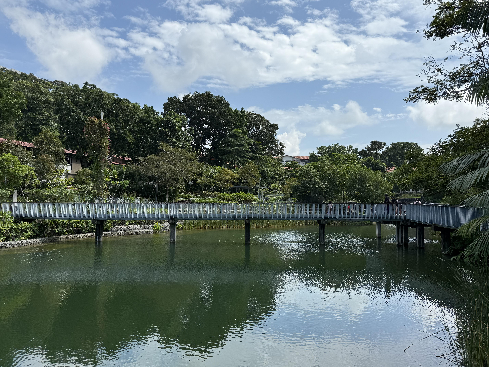
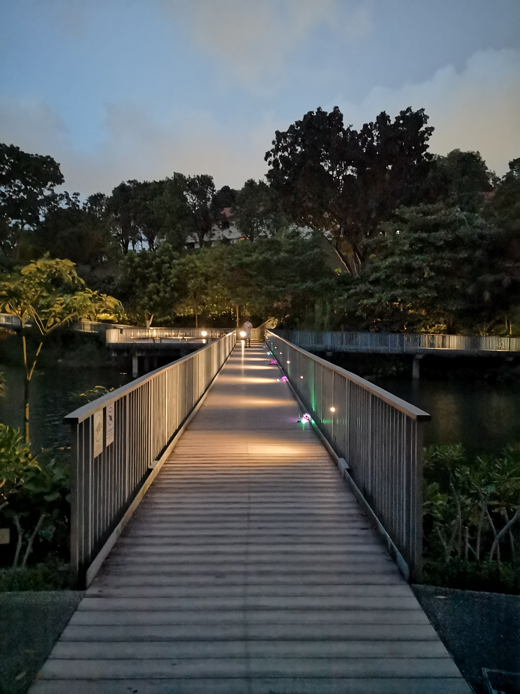
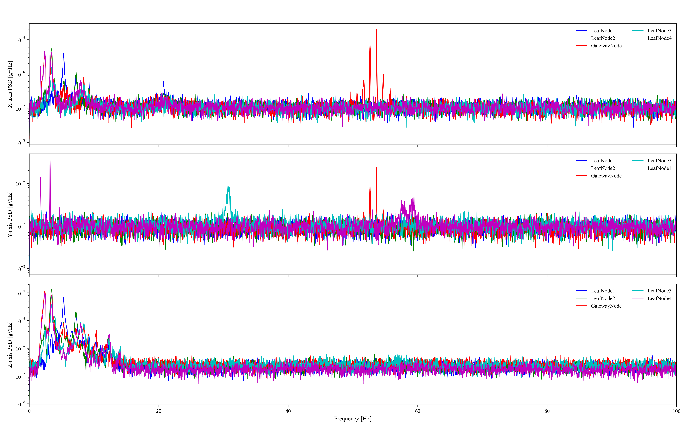

# FIELD TEST 1

## The Footbridge over Nanyang Lake at Nanyang Technological University

## WSN Setup

## Sampling Setup

Excitation Method: Shaking the handrail by hand, lasting about 2-3 seconds each time.

Sampling Frequency: 200Hz

Sampling Duration: 300 seconds

## Data Analysis

### Time History

### Frequency Spectrum Analysis

