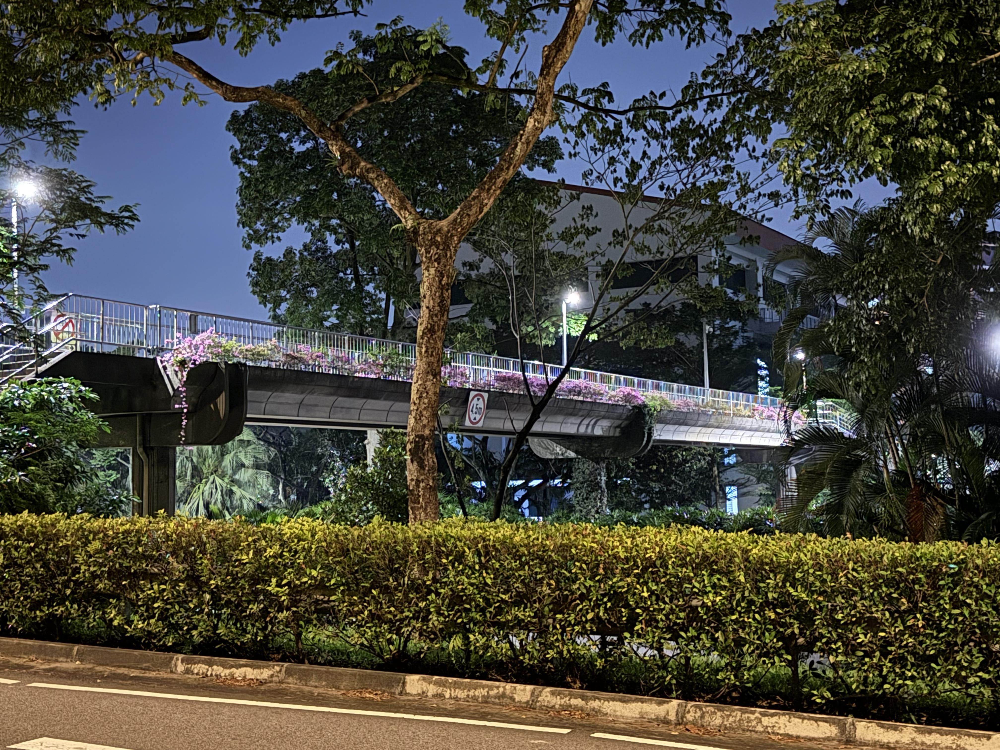
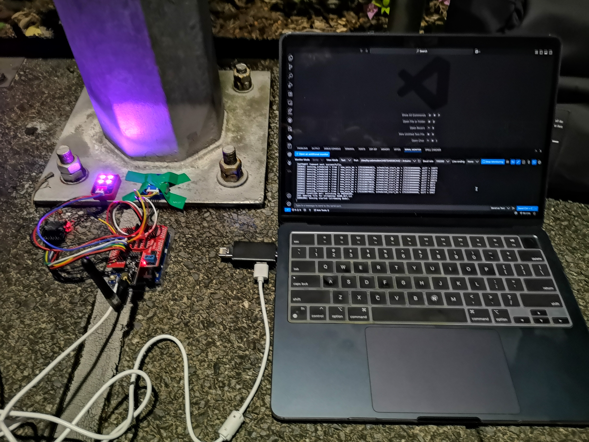
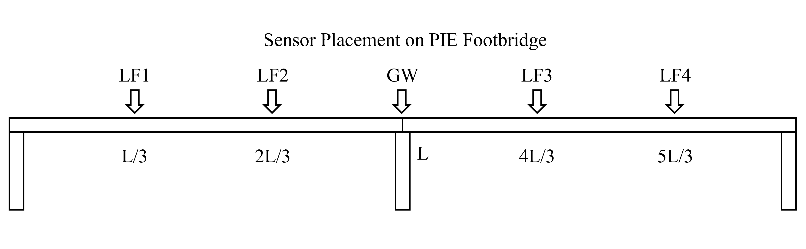
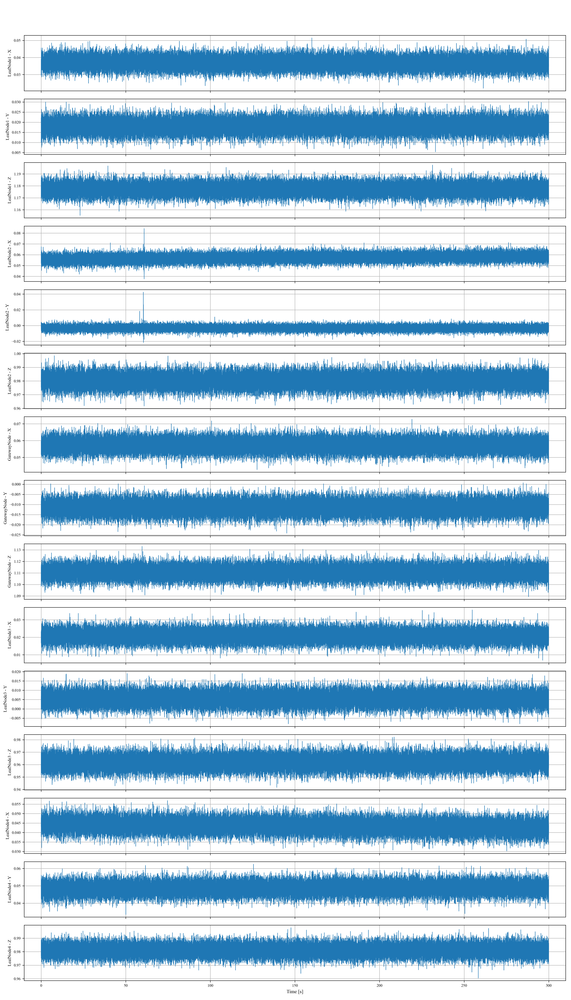
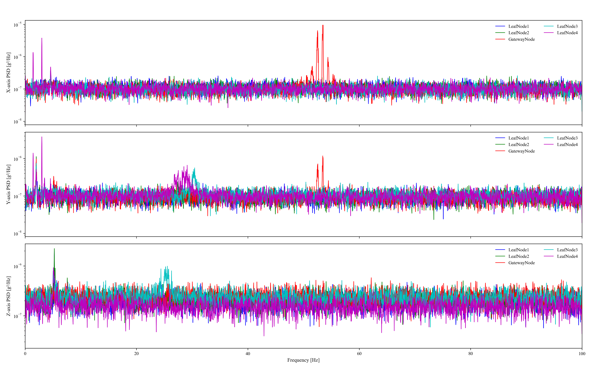

# FIELD TEST 2

## Footbridge over Highway

## WSN Setup

## Sampling Setup

Excitation Method: No manual excitation, relying on vibrations from passing vehicles.

Sampling Frequency: 200Hz

Sampling Duration: 300 seconds

## Data Analysis

### Time History

### Frequency Spectrum Analysis

