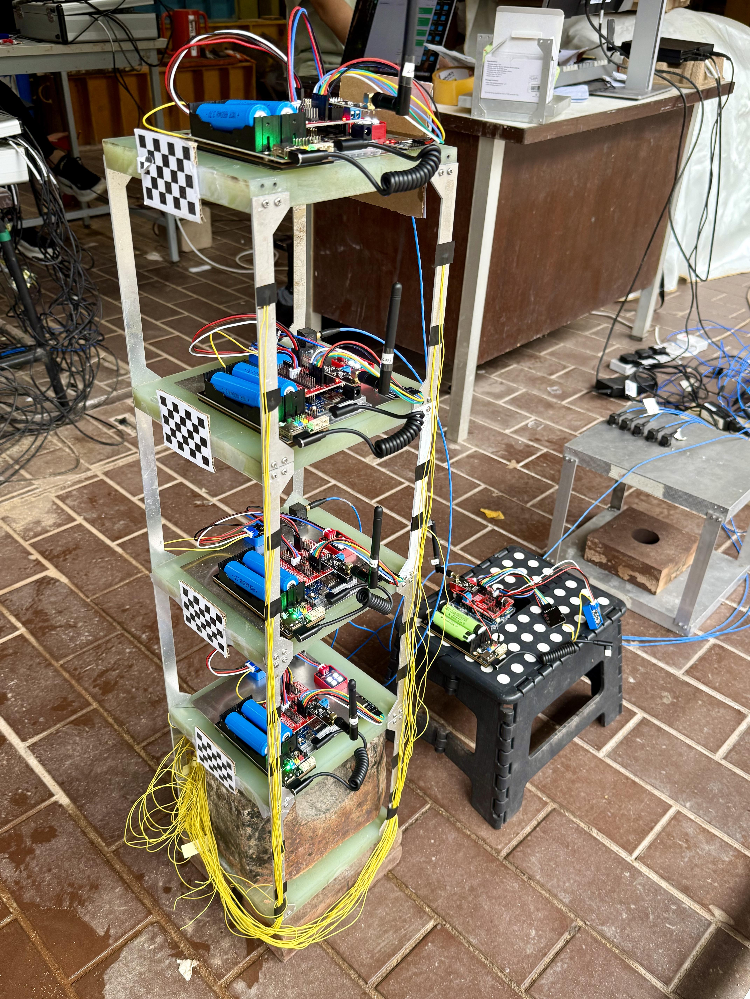

# LABORATORY TESTS

## TEST GOALS

- To test the basic sampling and transmission capabilities of the ArduinoNode.

- To cross-verify the data with a known good sensor by conducting modal analyses.

## TEST PROCEDURE - Ambient Vibration

- Set up the Arduino Nodes.

- Set up PCB sensors along side the Arduino Nodes.

- Issue commands to the Arduino Nodes to sample data at prescribed time, sampling rate, and duration. (100Hz sampling for 5 minutes)

- Issue commands to the PCB sensors to sample data at prescribed time, sampling rate, and duration. The duration should cover the time period of the Arduino Node sampling.  (100Hz sampling for 5 minutes)

- Receive the data from the Arduino Nodes and PCB sensors.

## TEST PROCEDURE - Free Vibration

- Set up the Arduino Nodes.

- Set up PCB sensors along side the Arduino Nodes.

- Issue commands to the Arduino Nodes to sample data at prescribed time, sampling rate, and duration. (100Hz sampling for 2 minutes)

- Issue commands to the PCB sensors to sample data at prescribed time, sampling rate, and duration. The duration should cover the time period of the Arduino Node sampling.  (100Hz sampling for 2 minutes)

- Receive the data from the Arduino Nodes and PCB sensors.

## RESULTS ANALYSIS

### Time History

### Frequency Spectrum

