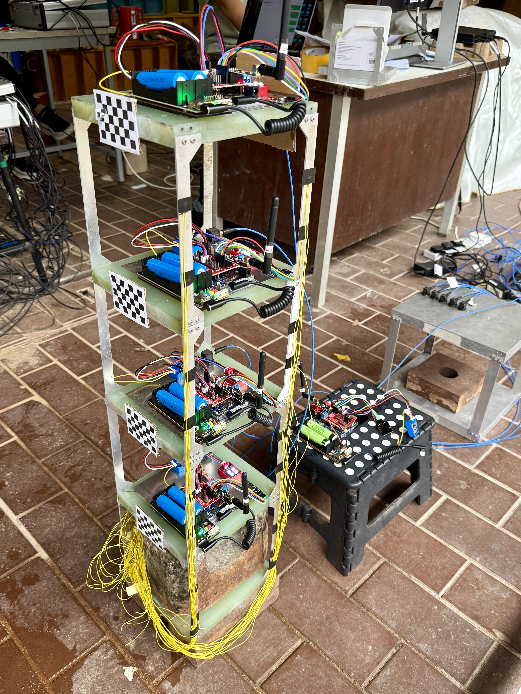

# 实验室测试

## 测试目标

- 测试 ArduinoNode 的基本采样与传输能力。

- 通过模态分析与已知优质传感器进行数据对比验证。

## 测试流程 - 环境振动测试

- 搭建 Arduino 节点。

- 在 Arduino 节点旁边布设 PCB 传感器。

- 向 Arduino 节点下发采样指令，指定采样时间、采样频率和持续时间。（以 100Hz 频率采样 5 分钟）

- 向 PCB 传感器下发采样指令，指定采样时间、采样频率和持续时间。采样时间应覆盖 Arduino 节点采样期间。（以 100Hz 频率采样 5 分钟）

- 接收来自 Arduino 节点与 PCB 传感器的采样数据。

## 测试流程 - 自由振动测试

- 搭建 Arduino 节点。

- 在 Arduino 节点旁边布设 PCB 传感器。

- 向 Arduino 节点下发采样指令，指定采样时间、采样频率和持续时间。（以 100Hz 频率采样 2 分钟）

- 向 PCB 传感器下发采样指令，指定采样时间、采样频率和持续时间。采样时间应覆盖 Arduino 节点采样期间。（以 100Hz 频率采样 2 分钟）

- 接收来自 Arduino 节点与 PCB 传感器的采样数据。

## 结果分析

### 时程曲线

### 频谱分析

