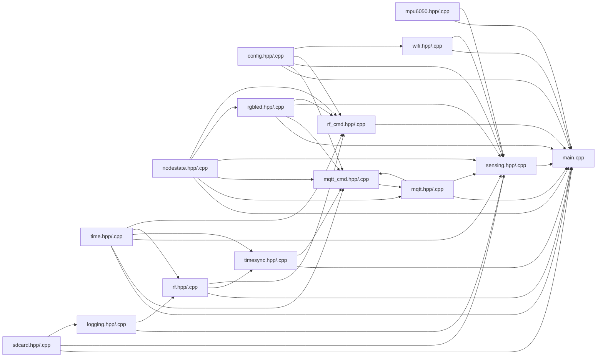

# ARCHITECTURE

In this project, the dependency graph of the software architecture is as follows:

```mermaid
graph LR

%% === Module Definitions ===
config["config.hpp/.cpp"]
nodestate["nodestate.hpp/.cpp"]
time["time.hpp/.cpp"]
mpu["mpu6050.hpp/.cpp"]
sd["sdcard.hpp/.cpp"]
rgb["rgbled.hpp/.cpp"]
log["logging.hpp/.cpp"]
mqtt["mqtt.hpp/.cpp"]
mqttcmd["mqtt_cmd.hpp/.cpp"]
sensing["sensing.hpp/.cpp"]
sync["timesync.hpp/.cpp"]
wifi["wifi.hpp/.cpp"]
rf["rf.hpp/.cpp"]
rf_cmd["rf_cmd.hpp/.cpp"]
main["main.cpp"]

%% === Module Relationships (Reversed Arrows) ===
config --> main
nodestate --> main
rgb --> main
mpu --> main
sd --> main
rf --> main
wifi --> main
time --> main
sync --> main
mqtt --> main
sensing --> main
rf_cmd --> main

nodestate --> mqtt
mqttcmd --> mqtt

config --> mqttcmd
time --> mqttcmd
sync --> mqttcmd
nodestate --> mqttcmd
rgb --> mqttcmd
mqtt --> mqttcmd

config --> sensing
nodestate --> sensing
time --> sensing
rgb --> sensing
mpu --> sensing
mqtt --> sensing
sd --> sensing
log --> sensing
wifi --> sensing

time --> sync
rf --> sync

sd --> log

nodestate --> rgb

log --> rf
time --> rf

rf --> rf_cmd
nodestate --> rf_cmd
rgb --> rf_cmd
config --> rf_cmd
time --> rf_cmd

config --> wifi


```