# 命令

如何控制节点是传感器开发中非常重要的一部分。传统的无线传感器网络可以通过控制主节点，进而通过无线通信控制其他节点。IoT节点，我们可以通过互联网进行远程控制。本项目中，我们通过WIFI和MQTT控制主节点，然后由主节点通过射频通信控制其他节点的方式实现节点控制。这种模式可以由下图所示：

```mermaid
flowchart TD
    %% === Participants ===
    User["🧑‍💻 Remote User (PC / Cloud)"]
    MQTT["☁️ MQTT Broker"]
    Gateway["🧠 Main Node (WiFi + RF)"]
    Leaf["🔧 Leaf Node (RF only)"]

    %% === Data Flow ===
    User -->|① Send CMD_SENSING| MQTT
    MQTT -->|② Deliver command| Gateway
    Gateway -->|③ Parse + Set flag| Gateway
    Gateway -->|④ Send RF command| Leaf
    Leaf -->|⑤ Parse + Schedule task| Leaf

```




## MQTT 部分

MQTT回调函数我们专门放在mqtt_cmd.hpp和mqtt_cmd.cpp文件中。如代码所示，MQTT回调函数对于收到的命令会先进行预设字段的匹配和解析，从中提取相关变量进行本地赋值，也会根据命令内容进行标志量设置或者状态切换。

```cpp

// Callback when subscribed message is received
void mqtt_callback(char *topic, byte *payload, unsigned int length)
{
    Serial.print("[COMMUNICATION] <MQTT> Message received [");
    Serial.print(topic);
    Serial.print("]: ");

    char message[length + 1];
    for (unsigned int i = 0; i < length; ++i)
    {
        message[i] = (char)payload[i];
        Serial.print(message[i]);
    }
    message[length] = '\0';
    Serial.println();

    // Clean trailing \r or \n
    while (length > 0 && (message[length - 1] == '\r' || message[length - 1] == '\n'))
    {
        message[--length] = '\0';
    }

    String msg_str(message);

    if (msg_str == "CMD_NTP")
    {
        node_status.node_flags.gateway_ntp_required = true;
        node_status.node_flags.leafnode_ntp_required = true;
        Serial.println("[COMMUNICATION] <CMD> CMD_NTP received.");

        // switch to COMMUNICATING state
        node_status.set_state(NodeState::WIFI_COMMUNICATING);
        rgbled_set_by_state(NodeState::WIFI_COMMUNICATING); // Set LED to blue during NTP sync
    }
    else if (msg_str == "CMD_RF_SYNC")
    {
        node_status.node_flags.time_rf_required = true;
        Serial.println("[COMMUNICATION] <CMD> CMD_RF_SYNC received.");
    }
    else if (msg_str == "CMD_SN")
    {
        Serial.println("[COMMUNICATION] <CMD> CMD_SN received.");

        node_status.node_flags.time_rf_required = true;

        // Get current system time in milliseconds
        uint64_t now_unix_ms = Time.get_time();
        uint64_t now_unix_ms_rounded = (now_unix_ms / 1000) * 1000; // Round down to nearest second

        // Schedule sensing: start after TIME_SYNC_RESERVED_TIME
        
        sensing_duration_s = default_sensing_duration_s; // Use default duration
        sensing_rate_hz = default_sensing_rate_hz;       // Use default rate

        parsed_freq = default_sensing_rate_hz;    // global variable at config.hpp
        parsed_duration = default_sensing_duration_s; // global variable at config.hpp

        sensing_scheduled_start_ms = now_unix_ms_rounded + TIME_SYNC_RESERVED_TIME;
        sensing_scheduled_end_ms = sensing_scheduled_start_ms + (sensing_duration_s * 1000);

        // Set sensing flags
        node_status.node_flags.sensing_requested = true;
        node_status.node_flags.sensing_scheduled = true;

        // Convert scheduled start time to human-readable calendar format
        CalendarTime start_ct = calendar_from_unix_milliseconds(sensing_scheduled_start_ms);

        // Print schedule details to Serial
        char buf[128];
        snprintf(buf, sizeof(buf),
                 "[MQTT] CMD_SN: Sensing scheduled at %04d-%02d-%02d %02d:%02d:%02d | Freq = %d Hz, Duration = %d s",
                 start_ct.year, start_ct.month, start_ct.day,
                 start_ct.hour, start_ct.minute, start_ct.second,
                 sensing_rate_hz, sensing_duration_s);
        Serial.println(buf);

        // Optionally publish feedback to MQTT broker
        mqtt_client.publish(MQTT_TOPIC_PUB, "CMD_SN: Sensing scheduled using default parameters.");
    }
    else if (msg_str.startsWith("CMD_SFN_"))
    {
        Serial.println("[COMMUNICATION] <CMD> CMD_SFN received.");

        node_status.node_flags.time_rf_required = true;

        int delay_sec, freq, duration;
        int matched = sscanf(message, "CMD_SFN_%d_%dHz_%ds", &delay_sec, &freq, &duration);

        if (matched == 3)
        {
            if (delay_sec * 1000 < TIME_SYNC_RESERVED_TIME)
            {
                Serial.println("[MQTT] CMD_SFN rejected: insufficient delay for time synchronization.");
                mqtt_client.publish(MQTT_TOPIC_PUB, "CMD_SFN ignored: delay too short for time sync.");
                rgbled_set_all(CRGB::Red); // Visual error indication
                delay(3000);
                if (node_status.get_state() == NodeState::IDLE)
                    rgbled_set_by_state(NodeState::IDLE);
            }
            else
            {
                uint64_t now_unix_ms = Time.get_time();
                uint64_t now_unix_ms_rounded = (now_unix_ms / 1000) * 1000; // Round down to nearest second
                sensing_scheduled_start_ms = now_unix_ms_rounded + (uint64_t)delay_sec * 1000;
                sensing_scheduled_end_ms = sensing_scheduled_start_ms + (uint64_t)duration * 1000;
                sensing_rate_hz = freq;
                sensing_duration_s = duration;

                parsed_freq = freq;    // global variable at config.hpp
                parsed_duration = duration; // global variable at config.hpp

                node_status.node_flags.sensing_requested = true;
                node_status.node_flags.sensing_scheduled = true;

                CalendarTime start_ct = calendar_from_unix_milliseconds(sensing_scheduled_start_ms);

                char buf[128];
                snprintf(buf, sizeof(buf),
                         "[MQTT] CMD_SFN: Sensing scheduled at %04d-%02d-%02d %02d:%02d:%02d | Freq = %d Hz, Duration = %d s",
                         start_ct.year, start_ct.month, start_ct.day,
                         start_ct.hour, start_ct.minute, start_ct.second,
                         sensing_rate_hz, sensing_duration_s);
                Serial.println(buf);

                mqtt_client.publish(MQTT_TOPIC_PUB, "CMD_SFN: Sensing successfully scheduled.");
            }
        }
        else
        {
            Serial.println("[MQTT] CMD_SFN format error.");
            mqtt_client.publish(MQTT_TOPIC_PUB, "CMD_SFN ignored: invalid format.");
            rgbled_set_all(CRGB::Red);
            delay(3000);
            if (node_status.get_state() == NodeState::IDLE)
                rgbled_set_by_state(NodeState::IDLE);
        }
    }
    else if (msg_str.startsWith("CMD_SENSING_"))
    {
        node_status.node_flags.time_rf_required = true;

        strncpy(cmd_sensing_raw, message, sizeof(cmd_sensing_raw) - 1);
        cmd_sensing_raw[sizeof(cmd_sensing_raw) - 1] = '\0';
        node_status.node_flags.sensing_requested = true;
        Serial.println("[COMMUNICATION] <CMD> CMD_SENSING received.");

        int y, mo, d, h, mi, s;
        int rate, dur;
        int matched = sscanf(message,
                             "CMD_SENSING_%d-%d-%d_%d:%d:%d_%dHz_%ds",
                             &y, &mo, &d, &h, &mi, &s, &rate, &dur);
        int ms_value = 0;

        if (matched == 8)
        {
            CalendarTime ParseTime;
            ParseTime.year = y;
            ParseTime.month = mo;
            ParseTime.day = d;
            ParseTime.hour = h;
            ParseTime.minute = mi;
            ParseTime.second = s;
            ParseTime.ms = 0;

            parsed_freq = rate;    // global variable at config.hpp
            parsed_duration = dur; // global variable at config.hpp

            uint64_t now_unix_ms = Time.get_time();
            uint64_t parsed_temp_sensing_start_ms = unix_from_calendar_milliseconds(ParseTime);

            if (now_unix_ms > parsed_temp_sensing_start_ms)
            {
                Serial.println("[MQTT] Sensing start time is in the past, ignoring command.");
                node_status.node_flags.sensing_requested = false;
                node_status.node_flags.sensing_scheduled = false;

                // feedback to the mqtt broker
                mqtt_client.publish(MQTT_TOPIC_PUB, "Sensing command ignored: start time is in the past!");

                rgbled_set_all(CRGB::Red); // Set LED to red to indicate error
                delay(3000);               // Wait for 2 seconds to indicate error
                if (node_status.get_state() == NodeState::IDLE)
                {
                    rgbled_set_by_state(NodeState::IDLE); // Reset LED to IDLE state
                }
            }
            else if (parsed_temp_sensing_start_ms < now_unix_ms + TIME_SYNC_RESERVED_TIME)
            {
                Serial.println("[ERROR] Not enough time for time synchronization, must larger than TIME_SYNC_RESERVED_TIME (by default 60 seconds), ignoring command.");
                node_status.node_flags.sensing_requested = false;
                node_status.node_flags.sensing_scheduled = false;

                // feedback to the mqtt broker
                mqtt_client.publish(MQTT_TOPIC_PUB, "Sensing command ignored: not enough time for time synchronization!");

                rgbled_set_all(CRGB::Red); // Set LED to red to indicate error
                delay(3000);               // Wait for 2 seconds to indicate error
                if (node_status.get_state() == NodeState::IDLE)
                {
                    rgbled_set_by_state(NodeState::IDLE); // Reset LED to IDLE state
                }
            }
            else
            {
                Serial.println("[MQTT] Scheduling sensing...");
                sensing_scheduled_start_ms = parsed_temp_sensing_start_ms;
                sensing_scheduled_end_ms = sensing_scheduled_start_ms + (parsed_duration * 1000);
                sensing_rate_hz = parsed_freq;
                sensing_duration_s = parsed_duration;

                node_status.node_flags.sensing_scheduled = true;

                char buf[128];
                snprintf(buf, sizeof(buf), "[MQTT] Sensing scheduled, sampling at %d Hz for %d seconds, starting at %04d-%02d-%02d %02d:%02d:%02d",
                         sensing_rate_hz, sensing_duration_s,
                         ParseTime.year, ParseTime.month, ParseTime.day,
                         ParseTime.hour, ParseTime.minute, ParseTime.second);
                Serial.println(buf);
            }
        }
        else
        {
            Serial.println("[MQTT] Failed to parse CMD_SENSING command.");
            node_status.node_flags.sensing_requested = false;
        }
    }
    else if (msg_str.startsWith("CMD_RETRIEVAL_"))
    {
        const char *filename_part = message + 14;
        snprintf(retrieval_filename, sizeof(retrieval_filename), "/%s.txt", filename_part);
        node_status.node_flags.data_retrieval_requested = true;
        node_status.node_flags.data_retrieval_sent = false; // Reset sent flag for new retrieval

        Serial.print("[COMMUNICATION] <CMD> CMD_RETRIEVAL received: ");
        Serial.println(retrieval_filename);

        // switch to COMMUNICATING state
        node_status.set_state(NodeState::WIFI_COMMUNICATING);
        rgbled_set_all(CRGB::Blue); // Set LED to blue during data retrieval
    }
    else if (msg_str == "CMD_REBOOT")
    {
        node_status.node_flags.reboot_required_gateway = true;
        node_status.node_flags.reboot_required_leafnode = true;
        Serial.println("[COMMUNICATION] <CMD> CMD_REBOOT received.");
    }
    else if (msg_str == "CMD_GATEWAY_REBOOT")
    {
        node_status.node_flags.reboot_required_gateway = true;
        Serial.println("[COMMUNICATION] <CMD> CMD_GATEWAY_REBOOT received.");
    }
    else if (msg_str == "CMD_LEAFNODE_REBOOT")
    {
        node_status.node_flags.reboot_required_leafnode = true;
        Serial.println("[COMMUNICATION] <CMD> CMD_LEAFNODE_REBOOT received.");
    }
    else
    {
        Serial.println("[COMMUNICATION] <CMD> Unknown command.");
    }
}

```

如代码所示，我们目前定义了几类命令：

1. 重启
2. NTP时间同步
3. 射频时间同步
4. 传感器采集
5. 数据检索

## 射频部分

为了处理射频部分的命令，我们专门设置了`rf_cmd.hpp`和`rf_cmd.cpp`文件。射频命令的处理逻辑与MQTT类似，主要是通过解析接收到的射频命令字符串来设置相应的标志位和状态。

```cpp
#pragma once
#include <Arduino.h>
#include "config.hpp"
#include "nodestate.hpp"
#include "rf.hpp"
#include "rgbled.hpp"
#include "wifi.hpp"
#include "mqtt.hpp"
#include "time.hpp"

#define RF_CMD_RETRY        3     
#define RF_CMD_WAIT_MS      100   

// For GATEWAY
void rf_command(const char *cmd);
void send_command_with_retry(const char *cmd);

// For LEAFNODE
void rf_handle();


```


```cpp
#include "rf_cmd.hpp"

void rf_command(const char *cmd)
{
    RFMessage msg;
    msg.from_id = NODE_ID;
    strncpy(msg.payload, cmd, sizeof(msg.payload));

    for (uint8_t target_id = 1; target_id <= NUM_NODES; ++target_id)
    {
        msg.to_id = target_id;

        Serial.print("[GATEWAY] Sending RF Command to Node ");
        Serial.print(target_id);
        Serial.print(": ");
        Serial.println(msg.payload);

        rf_stop_listening();
        bool success = rf_send(msg.to_id, msg);
        if (success)
        {
            Serial.println("[GATEWAY] Command sent successfully.");
        }
        else
        {
            Serial.println("[GATEWAY] Failed to send command.");
        }
        rf_start_listening();
    }
}

void send_command_with_retry(const char *cmd)
{
    for (int attempt = 0; attempt < RF_CMD_RETRY; ++attempt)
    {
        rf_command(cmd);
        delay(RF_CMD_WAIT_MS);
    }
}

void rf_handle()
{
    RFMessage msg;

    if (rf_receive(msg, 200)) // 200ms timeout
    {
        if (msg.to_id != NODE_ID)
            return;

        Serial.print("[RF_COMMUNICATION] Message received from Node ");
        Serial.print(msg.from_id);
        Serial.print(": ");
        Serial.println(msg.payload);

        // === CMD_REBOOT ===
        if (strcmp(msg.payload, "CMD_REBOOT") == 0)
        {
            Serial.println("[LEAFNODE] Reboot command received.");
            node_status.node_flags.reboot_required_leafnode = true;
            node_status.set_state(NodeState::BOOT);
            rgbled_set_by_state(NodeState::BOOT);
        }

        // === CMD_RF_SYNC ===
        else if (strcmp(msg.payload, "CMD_RF_SYNC") == 0)
        {
            Serial.println("[LEAFNODE] RF Sync command received.");
            node_status.node_flags.time_rf_required = true;
            node_status.set_state(NodeState::RF_COMMUNICATING);
            rgbled_set_by_state(NodeState::RF_COMMUNICATING);
        }

        // === Sensing Schedule Command ===
        else if (strncmp(msg.payload, "S_", 2) == 0)
        {
            Serial.println("[LEAFNODE] Sensing command received.");

            // Step 1: Extract 12-digit time
            char datetime[13] = {0};
            strncpy(datetime, msg.payload + 2, 12);

            // Step 2: Find first and second underscore after time part
            const char *ptr = msg.payload + 14;
            const char *first_underscore = strchr(ptr, '_');
            if (!first_underscore)
            {
                Serial.println("[LEAFNODE] Invalid sensing command format: missing first underscore.");
                return;
            }

            const char *second_underscore = strchr(first_underscore + 1, '_');
            if (!second_underscore)
            {
                Serial.println("[LEAFNODE] Invalid sensing command format: missing second underscore.");
                return;
            }

            // Step 3: Extract substrings for rate and duration
            char rate_buf[6] = {0};
            char dur_buf[6] = {0};

            size_t rate_len = second_underscore - (first_underscore + 1);
            size_t dur_len = strlen(second_underscore + 1);

            if (rate_len >= sizeof(rate_buf) || dur_len >= sizeof(dur_buf))
            {
                Serial.println("[LEAFNODE] Rate or duration value too long.");
                return;
            }

            strncpy(rate_buf, first_underscore + 1, rate_len);
            strncpy(dur_buf, second_underscore + 1, dur_len);

            int rate = atoi(rate_buf);
            int dur = atoi(dur_buf);

            CalendarTime SensingSchedule;
            SensingSchedule = YYMMDDHHMMSS2Calendar(datetime);

            parsed_freq = rate;
            sensing_rate_hz = parsed_freq;
            parsed_duration = dur;
            sensing_duration_s = parsed_duration;

            sensing_scheduled_start_ms = unix_from_calendar_milliseconds(SensingSchedule);
            sensing_scheduled_end_ms = sensing_scheduled_start_ms + dur * 1000;

            node_status.node_flags.sensing_scheduled = true; // very important!

            // Debug print
            Serial.print("[LEAFNODE] Parsed Time: ");
            Serial.print(SensingSchedule.year);
            Serial.print("-");
            Serial.print(SensingSchedule.month);
            Serial.print("-");
            Serial.print(SensingSchedule.day);
            Serial.print(" ");
            Serial.print(SensingSchedule.hour);
            Serial.print(":");
            Serial.print(SensingSchedule.minute);
            Serial.print(":");
            Serial.println(SensingSchedule.second);

            Serial.print("[LEAFNODE] Parsed Rate = ");
            Serial.print(parsed_freq);
            Serial.print(" Hz, Duration = ");
            Serial.print(parsed_duration);
            Serial.println(" sec");

            Serial.print("[LEAFNODE] Scheduled Start Time (ms): ");
            Serial.println(sensing_scheduled_start_ms);

            Serial.print("[LEAFNODE] Scheduled Sampling Rate: ");
            Serial.print(sensing_rate_hz);

            Serial.print(" Hz, Duration: ");
            Serial.print(sensing_duration_s);
            Serial.println(" sec");
        }
        // === Unknown Command ===
        else
        {
            Serial.println("[RF_COMMUNICATION] Unknown command.");
        }
    }
}

```


