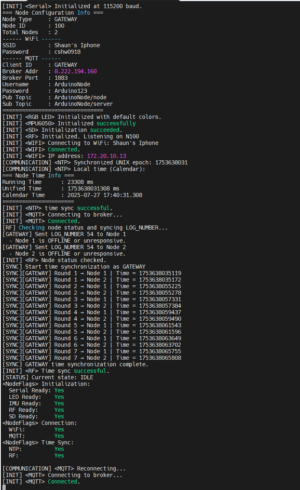

# 开发框架

!!! tip "框架概述"
    简单起见，本项目没有引入RTOS，而是直接基于单片机的"初始化"和"循环"的基本模型来进行开发，在此基础上，引入了状态机模型来管理不同的状态。框架的核心是`main.cpp`文件，里面包含了初始化和循环的基本逻辑。传感，通信，存储等功能都封装为了函数，方便按需调用。

## 第一部分 初始化部分

初始化部分负责设置硬件、配置外设以及初始化各种模块。在本项目中，初始化主要包括以下几个方面：

- 硬件配置：设置GPIO、UART、SPI等外设的引脚和参数。
- 模块初始化：初始化传感器、通信模块（如Wi-Fi等）、存储模块等。
- 系统设置：时钟同步、系统参数配置等。

```txt
+=============================+        +=============================+
|         GATEWAY NODE        |        |          LEAF NODE          |
+=============================+        +=============================+
| - Init serial               |        | - Init serial               |
| - Init RGB LED              |        | - Init RGB LED              |
| - Init IMU                  |        | - Init IMU                  |
| - Init SD card              |        | - Init SD card              |
| - Init RF module            |        | - Init RF module            |
| - Connect WiFi              |        |                             |
| - Sync time (NTP)           |        |                             |
| - Setup MQTT                |        |                             |
| - RF time sync              | <====> | - RF time sync              |
| - Wait for tasks            |        | - Wait for schedule         |
+-----------------------------+        +-----------------------------+

```

以下是一个典型的启动过程主节点串口输出示例:



!!! tip
    尽管每个节点都可以通过Wi-Fi连接到互联网，但出于实际考虑，本项目只使用主节点连接到互联网。


## 第二部分 循环部分

循环部分是程序的核心，负责不断地执行传感、处理和通信等任务。在本项目中，循环部分主要通过监测一系列标志量通过状态机来管理不同的状态。在循环部分，子节点在IDLE状态中会持续监听主节点的信息，在接收到信息后进行解析并执行相应的操作。

```txt
+===============================================================================================+
|                                     LOOP START                                                |
|                                                                                               |
|  +------+------+-----------+----------+------------------+--------------------+-------+       |
|  | BOOT | IDLE | PREPARING | SAMPLING | RF_COMMUNICATING | WIFI_COMMUNICATING | ERROR |       |
|  +------+------+-----------+----------+------------------+--------------------+-------+       |
|                                                                                               |
|  → Check current state → Execute logic → Repeat                                               |
+===============================================================================================+

```


## 第三部分 后台回调

后台回调部分是指在程序运行过程中，某些事件发生时自动触发的函数。这些回调函数通常用于处理异步事件，如接收数据、定时器超时等。本项目中，主要是用来侦听通讯模块的消息，并根据消息内容进行相应的处理。

```txt
+============================+                           +============================+
|        FOREGROUND          |                           |        BACKGROUND          |
|  (Main thread execution)   |                           |   (Interrupts / Callbacks) |
+============================+                           +============================+
|                            |                           |                            |
|  setup():                  |                           |  - RF receive interrupt    |
|  - Init serial / LED       |                           |  - MQTT message callback   |
|  - Init IMU / SD / RF      |                           |  - Timer / millis() event  |
|  - WiFi + NTP + MQTT       |                           |                            |
|                            |                           |                            |
|  loop():                   |                           |                            |
|  - Check node state        | <--------- flags -------- |  - Set flags / schedule    |
|  - Execute logic           | --------> state change -> |  - Modify state machine    |
|  - Maintain MQTT (only GW) |                           |                            |
|  - Transition states       |                           |                            |
|                            |                           |                            |
+============================+                           +============================+

```

