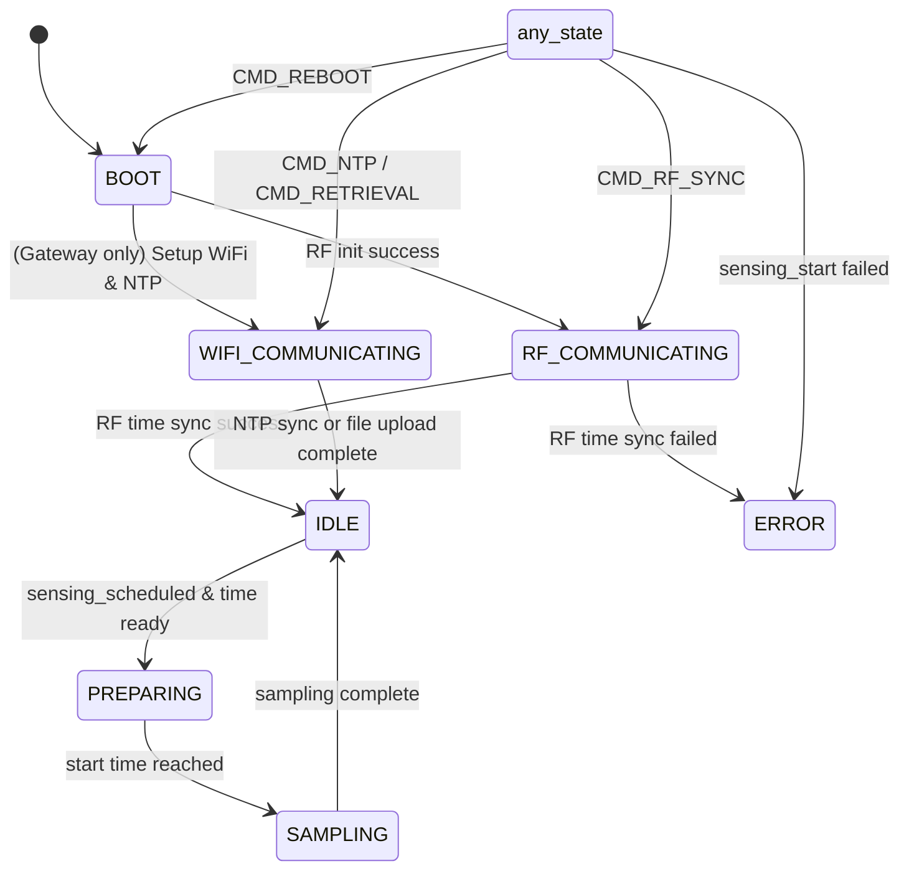

# STATE MACHINE AND INDICATORS

Without the introduction of a real-time operating system, a state machine is a common method for implementing complex logic. It manages system behavior by defining states and transitions between states. A state machine can help simplify the code structure and make the logic clearer and easier to understand.

## Design Explanation

In this project, the core is to distinguish between sampling and non-sampling states. Since the sampling state consumes more resources, some operations in the non-sampling state may lead to system instability if performed during the sampling state. Therefore, a clear distinction is necessary. The non-sampling states are further divided into startup, idle, preparing, WIFI communicating, RF communication, and error states. After the device completes initialization, each loop first determines the current state to execute the corresponding operations. In addition to states, we define a series of flags to assist the state machine in state transitions and operations.

In terms of implementation, we can define some structures and a state machine class that includes the current state, flags, and methods to set the state and print state information. Through this approach, we can clearly manage the node's state and related flags in the code.

## State Transition Map



## Related Code

### nodestate.hpp

```cpp
#pragma once

// === Mutually exclusive node states ===
enum class NodeState
{
    BOOT,
    IDLE, // routine operation & monitoring
    PREPARING, // no routine operation, preparing for sensing
    SAMPLING, // actively sampling data
    RF_COMMUNICATING, // communicating with other nodes via RF
    WIFI_COMMUNICATING, // communicating with server via WiFi
    ERROR // error state
};

// === Non-mutually-exclusive status flags ===
struct NodeFlags
{
    // Reboot Flags
    bool reboot_required_gateway = false; // Reboot command received for gateway
    bool reboot_required_leafnode = false; // Reboot command received for leaf node

    // Initialization Flags
    bool serial_ready = false;    // Serial communication ready status
    bool led_ready = false;       // LED ready status
    bool imu_ready = false;       // IMU sensor ready status
    bool rf_ready = false;        // RF communication ready status
    bool sd_ready = false;         // SD card ready status

    // Key Connection Flags
    bool wifi_connected = false;   // WiFi connection status
    bool mqtt_connected = false;   // MQTT connection status

    // Time Synchronization Flags
    bool time_ntp_synced = false;   // NTP time synchronization status
    bool time_rf_synced = false;   // RF time synchronization status
    bool gateway_ntp_required = false; // Gateway NTP required status
    bool leafnode_ntp_required = false; // Leaf node NTP required status
    bool time_rf_required = false; // RF time sync required status

    // Sensing Flags
    bool sensing_requested = false; // Sensing command received status
    bool sensing_scheduled = false; // Sensing schedule status
    bool sensing_active = false;    // Sensing activity status

    // Data Logging Flags
    bool data_retrieval_requested = false; // Data retrieval request status
    bool data_retrieval_sent = true; // Data retrieval sent status, by default true, meaning already sent
};

// === State Manager ===
class NodeStatusManager
{
public:
    // Current state & flags
    NodeState node_state;
    NodeFlags node_flags;

    // Constructor
    NodeStatusManager();

    // State setters
    void set_state(NodeState new_state);
    NodeState get_state() const;

    // Debug print
    void print_state() const;
};

// Global instance
extern NodeStatusManager node_status;

```

### nodestate.cpp

```cpp
#include <Arduino.h>
#include "nodestate.hpp"

// Define the global instance
NodeStatusManager node_status;

// Constructor implementation
NodeStatusManager::NodeStatusManager()
{
    node_state = NodeState::BOOT;

    // All flags initialized to false by default via struct default values
}

// Set current node state
void NodeStatusManager::set_state(NodeState new_state)
{
    node_state = new_state;
}

// Get current node state
NodeState NodeStatusManager::get_state() const
{
    return node_state;
}

// Print current state and flags
void NodeStatusManager::print_state() const
{
    Serial.print("[STATUS] Current state: ");
    switch (node_state)
    {
    case NodeState::BOOT:
        Serial.println("BOOT");
        break;
    case NodeState::IDLE:
        Serial.println("IDLE");
        break;
    case NodeState::PREPARING:
        Serial.println("PREPARING");
        break;
    case NodeState::SAMPLING:
        Serial.println("SAMPLING");
        break;
    case NodeState::RF_COMMUNICATING:
        Serial.println("RF_COMMUNICATING");
        break;
    case NodeState::WIFI_COMMUNICATING:
        Serial.println("WIFI_COMMUNICATING");
        break;
    case NodeState::ERROR:
        Serial.println("ERROR");
        break;
    default:
        Serial.println("UNKNOWN");
        break;
    }

    Serial.println("<NodeFlags> Initialization:");
    Serial.print("  Serial Ready: ");
    Serial.println(node_flags.serial_ready ? "Yes" : "No");
    Serial.print("  LED Ready:    ");
    Serial.println(node_flags.led_ready ? "Yes" : "No");
    Serial.print("  IMU Ready:    ");
    Serial.println(node_flags.imu_ready ? "Yes" : "No");
    Serial.print("  RF Ready:     ");
    Serial.println(node_flags.rf_ready ? "Yes" : "No");
    Serial.print("  SD Ready:     ");
    Serial.println(node_flags.sd_ready ? "Yes" : "No");

    Serial.println("<NodeFlags> Connection:");
    Serial.print("  WiFi:         ");
    Serial.println(node_flags.wifi_connected ? "Yes" : "No");
    Serial.print("  MQTT:         ");
    Serial.println(node_flags.mqtt_connected ? "Yes" : "No");

    Serial.println("<NodeFlags> Time Sync:");
    Serial.print("  NTP:          ");
    Serial.println(node_flags.time_ntp_synced ? "Yes" : "No");
    Serial.print("  RF:           ");
    Serial.println(node_flags.time_rf_synced ? "Yes" : "No");

    Serial.println();
}

```