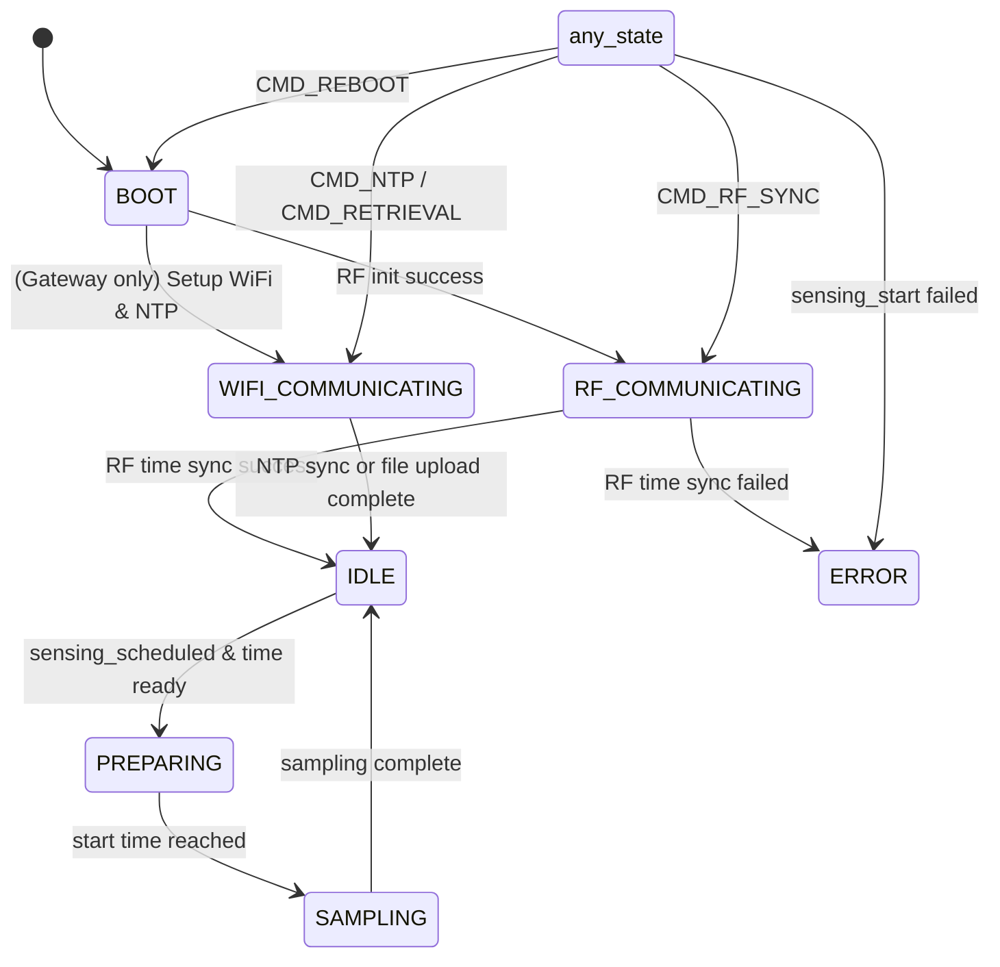

# 状态机与标志量

在不引入实时操作系统的情况下，状态机是实现复杂逻辑的常用方法。它通过定义状态和状态之间的转换来管理系统行为。状态机可以帮助简化代码结构，使得逻辑更清晰易懂。

## 设计说明

本项目中，核心是区分采集状态和非采集状态，由于采集状态下对资源消耗较大，非采集状态下的一些操作如果在采集状态下进行可能会导致系统不稳定，因此需要明确区分。非采集状态我们又进一步分为了启动，空闲、准备、WIFI通信, RF通讯和错误状态。在设备完成初始化之后，每一次循环都会先判定所处的状态，从而执行对应的操作。在状态之外，我们定义了一系列标志量，用来辅助状态机进行状态切换和操作。

在实现上来说，我们定义了一些结构体和一个状态机类，包含了当前状态、标志量以及一些方法来设置状态和打印状态信息。通过这种方式，我们可以在代码中清晰地管理节点的状态和相关标志。

## 状态切换逻辑



## 相关代码

### nodestate.hpp

```cpp
#pragma once

// === Mutually exclusive node states ===
enum class NodeState
{
    BOOT,
    IDLE, // routine operation & monitoring
    PREPARING, // no routine operation, preparing for sensing
    SAMPLING, // actively sampling data
    RF_COMMUNICATING, // communicating with other nodes via RF
    WIFI_COMMUNICATING, // communicating with server via WiFi
    ERROR // error state
};

// === Non-mutually-exclusive status flags ===
struct NodeFlags
{
    // Reboot Flags
    bool reboot_required_gateway = false; // Reboot command received for gateway
    bool reboot_required_leafnode = false; // Reboot command received for leaf node

    // Initialization Flags
    bool serial_ready = false;    // Serial communication ready status
    bool led_ready = false;       // LED ready status
    bool imu_ready = false;       // IMU sensor ready status
    bool rf_ready = false;        // RF communication ready status
    bool sd_ready = false;         // SD card ready status

    // Key Connection Flags
    bool wifi_connected = false;   // WiFi connection status
    bool mqtt_connected = false;   // MQTT connection status

    // Time Synchronization Flags
    bool time_ntp_synced = false;   // NTP time synchronization status
    bool time_rf_synced = false;   // RF time synchronization status
    bool gateway_ntp_required = false; // Gateway NTP required status
    bool leafnode_ntp_required = false; // Leaf node NTP required status
    bool time_rf_required = false; // RF time sync required status

    // Sensing Flags
    bool sensing_requested = false; // Sensing command received status
    bool sensing_scheduled = false; // Sensing schedule status
    bool sensing_active = false;    // Sensing activity status

    // Data Logging Flags
    bool data_retrieval_requested = false; // Data retrieval request status
    bool data_retrieval_sent = true; // Data retrieval sent status, by default true, meaning already sent
};

// === State Manager ===
class NodeStatusManager
{
public:
    // Current state & flags
    NodeState node_state;
    NodeFlags node_flags;

    // Constructor
    NodeStatusManager();

    // State setters
    void set_state(NodeState new_state);
    NodeState get_state() const;

    // Debug print
    void print_state() const;
};

// Global instance
extern NodeStatusManager node_status;

```

### nodestate.cpp

```cpp
#include <Arduino.h>
#include "nodestate.hpp"

// Define the global instance
NodeStatusManager node_status;

// Constructor implementation
NodeStatusManager::NodeStatusManager()
{
    node_state = NodeState::BOOT;

    // All flags initialized to false by default via struct default values
}

// Set current node state
void NodeStatusManager::set_state(NodeState new_state)
{
    node_state = new_state;
}

// Get current node state
NodeState NodeStatusManager::get_state() const
{
    return node_state;
}

// Print current state and flags
void NodeStatusManager::print_state() const
{
    Serial.print("[STATUS] Current state: ");
    switch (node_state)
    {
    case NodeState::BOOT:
        Serial.println("BOOT");
        break;
    case NodeState::IDLE:
        Serial.println("IDLE");
        break;
    case NodeState::PREPARING:
        Serial.println("PREPARING");
        break;
    case NodeState::SAMPLING:
        Serial.println("SAMPLING");
        break;
    case NodeState::RF_COMMUNICATING:
        Serial.println("RF_COMMUNICATING");
        break;
    case NodeState::WIFI_COMMUNICATING:
        Serial.println("WIFI_COMMUNICATING");
        break;
    case NodeState::ERROR:
        Serial.println("ERROR");
        break;
    default:
        Serial.println("UNKNOWN");
        break;
    }

    Serial.println("<NodeFlags> Initialization:");
    Serial.print("  Serial Ready: ");
    Serial.println(node_flags.serial_ready ? "Yes" : "No");
    Serial.print("  LED Ready:    ");
    Serial.println(node_flags.led_ready ? "Yes" : "No");
    Serial.print("  IMU Ready:    ");
    Serial.println(node_flags.imu_ready ? "Yes" : "No");
    Serial.print("  RF Ready:     ");
    Serial.println(node_flags.rf_ready ? "Yes" : "No");
    Serial.print("  SD Ready:     ");
    Serial.println(node_flags.sd_ready ? "Yes" : "No");

    Serial.println("<NodeFlags> Connection:");
    Serial.print("  WiFi:         ");
    Serial.println(node_flags.wifi_connected ? "Yes" : "No");
    Serial.print("  MQTT:         ");
    Serial.println(node_flags.mqtt_connected ? "Yes" : "No");

    Serial.println("<NodeFlags> Time Sync:");
    Serial.print("  NTP:          ");
    Serial.println(node_flags.time_ntp_synced ? "Yes" : "No");
    Serial.print("  RF:           ");
    Serial.println(node_flags.time_rf_synced ? "Yes" : "No");

    Serial.println();
}

```