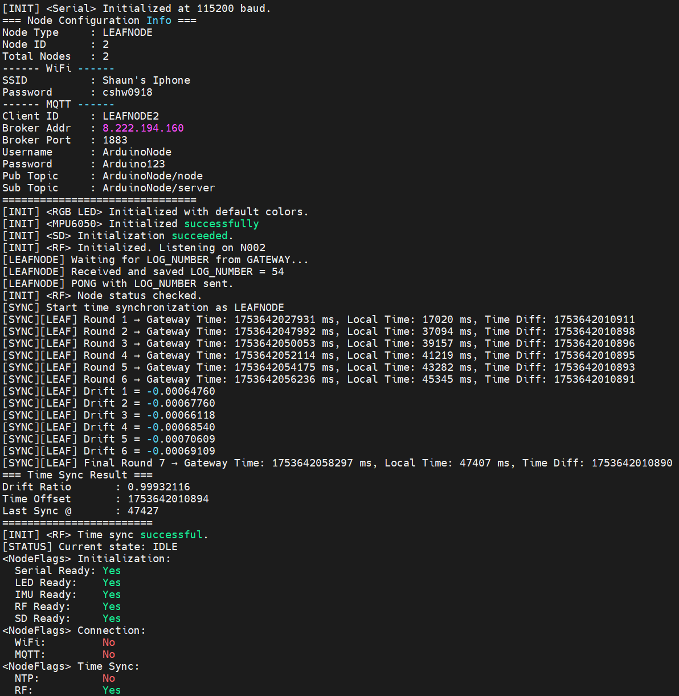

# 时间同步

时间同步对于无线网络设备至关重要。它确保设备之间的时间一致性，从而使得数据包的时间戳、日志记录和其他时间相关的功能能够正确工作。在本项目中时间同步我们分两个部分来展开，第一部分是与互联网的时间同步，第二部分是设备之间的时间同步。

在讨论开始之前，我们先来看一下代码。

**time.hpp**

```cpp
#pragma once
#include <Arduino.h>
#include "config.hpp"
#include "nodestate.hpp"

#define SYNC_ROUNDS 7
#define SYNC_INTERVAL_1 20000
#define SYNC_INTERVAL_N 2000
#define TIME_SYNC_RESERVED_TIME 60000 // means reserve at least 60 seconds for time sync when issuing a sensing command

/*
 * Time synchronization header
 * 
 * Provides:
 * - NTP synchronization function
 * - RF time synchronization function by drift ratio and offset
 */

bool sync_time_ntp();
bool rf_time_sync();
```

**time.cpp**

```cpp
#include <WiFiUdp.h>
#include <NTPClient.h>
#include "time.hpp"
#include "timesync.hpp"
#include "rf.hpp"

WiFiUDP ntpUDP;
NTPClient timeClient(ntpUDP, "asia.pool.ntp.org", 28800, 60000);

bool sync_time_ntp()
{
    timeClient.begin();
    const uint64_t MIN_VALID_EPOCH = 1735689600; // 2025-01-01 00:00:00 UTC
    bool success = false;

    for (int attempt = 1; attempt <= 5; ++attempt)
    {
        if (!timeClient.update())
        {
            Serial.print("[COMMUNICATION] <NTP> Attempt ");
            Serial.print(attempt);
            Serial.println(": Failed to get NTP time.");
            delay(1000);
            continue;
        }

        uint64_t epoch = timeClient.getEpochTime();
        if (epoch < MIN_VALID_EPOCH)
        {
            Serial.print("[COMMUNICATION] <NTP> Attempt ");
            Serial.print(attempt);
            Serial.print(": Invalid epoch = ");
            Serial.println(epoch);
            delay(1000);
            continue;
        }

        // === Valid time received ===
        uint64_t now_millis = millis();
        uint64_t epoch_ms = epoch * 1000ULL + now_millis % 1000ULL;

        Time.last_sync_running_time = now_millis;
        Time.time_offset = epoch_ms - now_millis;

        Serial.print("[COMMUNICATION] <NTP> Synchronized UNIX epoch: ");
        Serial.println(epoch);

        Serial.println("[COMMUNICATION] <NTP> Local time (Calendar): ");
        Time.show_time(); // Print calendar and unified time

        success = true;
        break;
    }

    if (!success)
    {
        Serial.println("[COMMUNICATION] <NTP> Final NTP sync failed after 5 attempts.");
    }

    return success;
}

bool rf_time_sync()
{
#ifdef GATEWAY
    Serial.println("[SYNC] Start time synchronization as GATEWAY");

    for (uint8_t round = 0; round < SYNC_ROUNDS; ++round)
    {   
        for (uint8_t node_id = 1; node_id <= NUM_NODES; ++node_id)
        {
            if (node_id == NODE_ID)
                continue;

            RFMessage msg;
            msg.from_id = NODE_ID;
            msg.to_id = node_id;

            uint64_t current_time = Time.get_time();

            uint32_t high = current_time >> 32;
            uint32_t low = current_time & 0xFFFFFFFF;
            snprintf(msg.payload, sizeof(msg.payload), "SYNC %lu %lu", high, low);
            msg.timestamp_ms = current_time;

            rf_stop_listening();
            rf_send(node_id, msg, false);
            rf_start_listening();

            Serial.print("[SYNC][GATEWAY] Round ");
            Serial.print(round + 1);
            Serial.print(" → Node ");
            Serial.print(node_id);
            Serial.print(" | Time = ");
            Serial.println(current_time);
        }

        if (round == 0)
            delay(SYNC_INTERVAL_1);
        else if (round < SYNC_ROUNDS - 1)
            delay(SYNC_INTERVAL_N);
    }

    Serial.println("[SYNC] GATEWAY time synchronization complete.");
    return true;
#endif

#ifdef LEAFNODE
    Serial.println("[SYNC] Start time synchronization as LEAFNODE");

    // === Step 1: Initialize arrays for each round ===
    uint64_t gateway_time[SYNC_ROUNDS] = {0};
    uint64_t local_time[SYNC_ROUNDS] = {0};
    int64_t time_diff[SYNC_ROUNDS] = {0};
    uint8_t received = 0;

    // === Step 2: Receive SYNC messages ===
    while (received < SYNC_ROUNDS)
    {
        RFMessage msg;
        if (rf_receive(msg, 100))
        {
            if (strncmp(msg.payload, "SYNC", 4) == 0 && msg.to_id == NODE_ID)
            {
                uint32_t high = 0, low = 0;
                sscanf(msg.payload, "SYNC %lu %lu", &high, &low);
                uint64_t gw_time = ((uint64_t)high << 32) | low;
                uint64_t local = millis();

                gateway_time[received] = gw_time;
                local_time[received] = local;
                time_diff[received] = static_cast<int64_t>(gw_time - local);

                // === Output the results for each round (except for the final round) ===
                if (received < SYNC_ROUNDS - 1)
                {
                    Serial.print("[SYNC][LEAF] Round ");
                    Serial.print(received + 1);
                    Serial.print(" → Gateway Time: ");
                    Serial.print(gw_time);
                    Serial.print(" ms, Local Time: ");
                    Serial.print(local);
                    Serial.print(" ms, Time Diff: ");
                    Serial.println(time_diff[received]);
                }

                received++;
            }
        }
    }

    // === Step 3: Calculate drift_ratio ===
    double drift_sum = 0.0;
    double drift_max = -1e9;
    double drift_min = 1e9;
    uint8_t drift_count = 0;

    for (uint8_t i = 1; i < SYNC_ROUNDS; ++i)
    {
        int64_t delta_t = static_cast<int64_t>(local_time[i] - local_time[0]);
        int64_t delta_T = static_cast<int64_t>(gateway_time[i] - gateway_time[0]);

        if (delta_t <= 0) continue;  // prevent division by zero or negative time

        // Calculate drift_ratio directly within the loop
        double drift_i = (static_cast<double>(delta_T - delta_t)) / delta_t;
        drift_sum += drift_i;
        drift_count++;

        if (drift_i > drift_max) drift_max = drift_i;
        if (drift_i < drift_min) drift_min = drift_i;

        // Debug prints for drift calculation
        Serial.print("[SYNC][LEAF] Drift ");
        Serial.print(i);
        Serial.print(" = ");
        Serial.println(drift_i, 8);  // Show drift value to 8 decimal places
    }

    double drift_cleaned_sum = drift_sum - drift_max - drift_min;
    double drift_avg = drift_cleaned_sum / (drift_count - 2);

    // === Step 4: Calculate offset using average of time_diff after removing max and min ===
    int64_t max_diff = time_diff[0];
    int64_t min_diff = time_diff[0];
    int64_t offset_sum = 0;

    for (uint8_t i = 0; i < SYNC_ROUNDS; ++i)
    {
        if (time_diff[i] > max_diff) max_diff = time_diff[i];
        if (time_diff[i] < min_diff) min_diff = time_diff[i];
        offset_sum += time_diff[i];
    }

    // Calculate offset average after removing max and min values
    int64_t offset_cleaned_sum = offset_sum - max_diff - min_diff;
    int64_t offset_avg = offset_cleaned_sum / (SYNC_ROUNDS - 2);

    // === Step 5: Update drift_ratio and time_offset ===
    Time.drift_ratio = 1.0 + drift_avg;
    Time.time_offset = offset_avg;  // Directly use offset_avg for time_offset

    // === Step 6: Record sync time and summary ===
    Time.record_sync_time();  // Record synchronization time after updating offset

    // === Output the final round result ===
    Serial.print("[SYNC][LEAF] Final Round ");
    Serial.print(SYNC_ROUNDS);
    Serial.print(" → Gateway Time: ");
    Serial.print(gateway_time[SYNC_ROUNDS - 1]);
    Serial.print(" ms, Local Time: ");
    Serial.print(local_time[SYNC_ROUNDS - 1]);
    Serial.print(" ms, Time Diff: ");
    Serial.println(time_diff[SYNC_ROUNDS - 1]);

    // Debug prints for final result
    Serial.println("=== Time Sync Result ===");
    Serial.print("Drift Ratio       : ");
    Serial.println(Time.drift_ratio, 8);  // Show drift ratio to 8 decimal places
    Serial.print("Time Offset       : ");
    Serial.println(Time.time_offset);

    Serial.print("Last Sync @       : ");
    Serial.println(Time.last_sync_running_time);
    Serial.println("========================");

    return true;
#endif

}


```

本项目中的时间同步分为两类：  
1. 与互联网进行时间同步（使用 NTP 协议）  
2. 设备之间进行本地时间同步（基于 RF 通信和 RTT 计算）

## 一、与互联网的时间同步 - Network Time Protocol (NTP)

NTP（网络时间协议）用于同步设备与互联网上标准时间服务器的时间。其基本原理如下：

- 本地设备发送时间请求，并记录本地发送时间 `t1`
- NTP 服务器接收请求，记录接收时间 `t2`
- NTP 服务器返回当前时间 `t3`
- 本地设备接收响应，并记录接收时间 `t4`

通过这些时间戳，本地设备可以估算网络延迟，并计算出精确的服务器时间以调整本地系统时间。

本项目中使用的相关函数是：

### `sync_time_ntp()`

该函数通过 `NTPClient` 库从互联网获取当前的 Unix 时间戳。其核心逻辑包括：

- 初始化 NTP 客户端并连接服务器
- 获取当前 UTC 时间（Unix timestamp）
- 将其转换并更新全局时间变量 `Time`
- 同时记录当前的运行时间（如 `millis()`），用于后续以毫秒精度推算当前时间

这种方式适用于设备刚启动时或需要校准的场景，缺点是依赖网络，并且精度受限（Arduino 平台通常精度只能到秒级）。

---

## 二、本地设备之间的时间同步 - FTSP 洪泛时间同步协议

本项目中使用洪泛时间同步协议，由主节点多次向子节点广播时间信息，子节点接收后计算时间偏差。其核心步骤如下：

1. **主节点（GATEWAY）广播时间信息**：主节点在每个同步轮次向所有子节点发送当前时间戳。
2. **子节点（LEAFNODE）接收时间信息**：子节点接
3. 接收到主节点的时间信息后，记录本地接收时间。
4. **计算时间偏差**：子节点根据接收到的时间戳和本地接收时间计算时间偏差。
5. **计算漂移率**：子节点在多轮同步中计算漂移率（drift ratio），即主节点时间与子节点本地时间的比率。
6. **更新本地时间**：子节点根据漂移率和偏差调整本地时间。
7. **记录同步时间**：子节点记录最后一次同步的时间戳，以便后续使用。

## 总结

为了兼顾精度与实用性，本项目设计中采用先通过 NTP 初始化时间，然后通过 RF 实现子节点的高精度同步。


!!! tip "注意"
    在实际应用中，NTP 同步通常用于设备启动时的初始时间设置，而 RF 同步则用于设备间的持续时间一致性维护。这样可以确保系统在网络不稳定或离线时仍能保持较高的时间精度。

## 串口输出示例

以下是一个典型的串口输出示例，展示了时间同步过程中的关键步骤：

